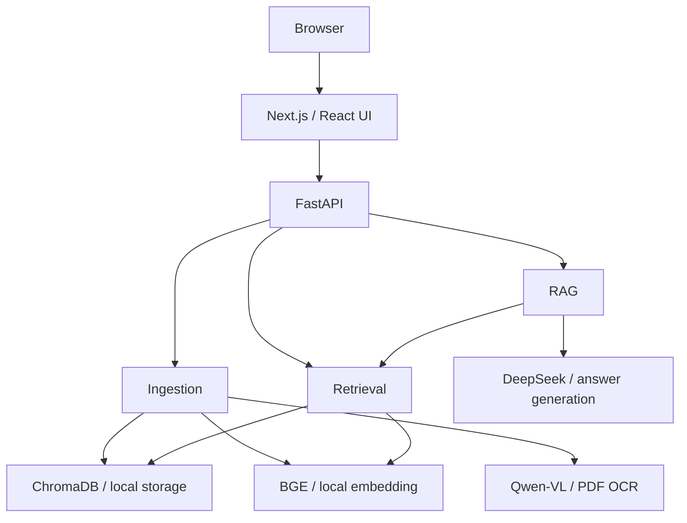
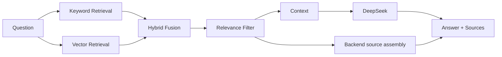

# DX-RAG

企业知识库 RAG 问答系统：上传文档，建立独立知识库，通过自然语言获取基于检索内容的回答与来源。

## Overview

DX-RAG 将文档解析、本地向量化、混合检索和大模型回答串联起来，适合查询课程资料、技术文档和内部知识。浏览器界面提供知识库管理、文件上传、知识问答和文件管理四个入口。

v1 面向本地或可信网络使用。文档和向量保存在本地，回答生成使用 DeepSeek；PDF 无原生文本的页面通过 DashScope Qwen-VL 识别。

## Features

- **独立知识库**：创建、列出、重命名和删除知识库，隔离各库的文件与检索内容。
- **多格式入库**：支持 11 种文件格式，完成校验、解析、清洗、切分、向量化和持久化；单文件上传默认上限 50 MB。
- **PDF 逐页处理**：优先提取原生文本，无文本页面使用 Qwen-VL OCR；部分页面识别失败时显示警告，整体入库失败时回滚。
- **混合检索**：结合关键词与向量检索，去重、加权融合并过滤低相关性结果。
- **带来源的问答**：DeepSeek 生成 Markdown 回答，后端从检索结果组装来源，界面可展开查看文件名与相关性分数。
- **多轮对话**：前端维护当前会话，每次请求携带最近 20 条历史消息。
- **文件管理**：查看文件列表、预览已入库文本、删除文件，并在删除后重新上传同名文件。

## Architecture



Next.js 提供交互界面，浏览器通过集中式 API client 请求 FastAPI。ChromaDB 使用本地持久化模式，无需额外启动数据库服务。

## Tech Stack

| 层次 | 技术 |
| --- | --- |
| 前端 | Next.js 14.2.24、React 18、TypeScript 5、Ant Design 5.22.7、React Markdown 9 |
| API 与配置 | FastAPI、Uvicorn、Pydantic Settings、python-multipart |
| 文档解析 | PyMuPDF、python-docx、openpyxl |
| 文本切分 | LangChain Text Splitters |
| 向量化与存储 | Sentence Transformers、BAAI/bge-small-zh-v1.5、ChromaDB |
| 回答与 OCR | OpenAI Python SDK（调用 DeepSeek Chat）、DashScope SDK（Qwen-VL-Plus） |

准确的依赖声明见 [backend/requirements.txt](backend/requirements.txt) 和 [frontend/package.json](frontend/package.json)。后端依赖多为最低版本约束，并非锁定环境。

## How It Works

**Ingestion**

```text
Validate → Parse → Clean → Chunk → Embed → ChromaDB
```

上传时先检查文件名、扩展名、大小、知识库和同名冲突，再保存原文件并执行入库流程。文本按 Markdown 标题和递归字符规则切分，默认 `MAX_CHUNK_SIZE=800`、`CHUNK_OVERLAP=120`。BGE 生成 **512 维、L2 归一化**向量，由应用显式写入 ChromaDB。

**Query**



两路分数统一到 `[0, 1]`，按 `chunk_id` 合并去重后计算：

```text
final_score = keyword_score × 0.3 + vector_score × 0.7
```

`keyword_weight=0.3`、`vector_weight=0.7` 是 v1 内部固定常量，不能通过环境变量或 API 调整。过滤掉低于 `MIN_RELEVANCE_SCORE=0.30` 的结果，再取 Top-K（默认 5），组装上下文（默认最多 4000 字符，不截断单个片段）。

DeepSeek 接收上下文、对话历史和问题，一次性返回回答（非流式）。来源由后端根据检索结果生成。没有相关片段时仍会调用模型，但上下文和来源为空，提示词要求明确说明无法从知识库找到答案。

## Getting Started

### Prerequisites

- Git。
- Python **3.10+**，以及 `venv`、`pip`。
- Node.js **18.17.0+** 和 npm（Next.js 14.2.24 的 Node 最低要求）。
- 本地完整的 `BAAI/bge-small-zh-v1.5` 模型文件，用于文档和问题向量化；模型权重不随仓库分发。
- 使用问答功能需要 DeepSeek API key；识别扫描/图片 PDF 页面还需要 DashScope API key，以及到对应服务的网络连接。

### Clone

```sh
git clone https://github.com/Raining127/DX-RAG.git
cd DX-RAG
```

### Backend setup

从仓库根目录进入后端并创建虚拟环境：

```sh
cd backend
python -m venv .venv
```

激活环境，按终端选择一种方式。Windows PowerShell：

```powershell
.\.venv\Scripts\Activate.ps1
```

macOS / Linux（若系统使用 `python3`，创建环境时也使用 `python3 -m venv .venv`）：

```sh
source .venv/bin/activate
```

安装后端依赖：

```sh
python -m pip install -r requirements.txt
```

将配置模板复制为本地配置（仅首次设置时执行，已有 `.env` 时不要覆盖）。Windows PowerShell：

```powershell
Copy-Item .env.example .env
```

macOS / Linux：

```sh
cp .env.example .env
```

在本地编辑 `backend/.env`。以下列出变量用途，不包含真实凭据：

| 变量 | 必需条件 / 默认值 |
| --- | --- |
| `DEEPSEEK_API_KEY` | 生成问答回答时必需；模板留空 |
| `DASHSCOPE_API_KEY` | PDF 无原生文本页面的 OCR 时必需；模板留空 |
| `EMBED_MODEL` | 默认 `models/bge-small-zh-v1.5`；入库和向量检索前需准备好模型 |
| `CHROMA_PERSIST_DIR` | 默认 `chroma_db`，保存本地向量数据 |
| `UPLOAD_DIR` | 默认 `uploads`，保存原始上传文件 |
| `CORS_ORIGINS` | 默认 `["*"]`；仅本机前端使用时可设为 `["http://localhost:3000"]` |
| `MIN_RELEVANCE_SCORE` | 默认 `0.30`，混合检索相关性阈值 |

其余设置可保留 [配置模板](backend/.env.example) 的默认值。API key 不影响基础服务启动，缺失时会在对应功能调用中报错。

在 `backend/`、已激活的虚拟环境中下载完整模型快照。`huggingface_hub` 由 Sentence Transformers 依赖安装；以下使用仓库验收记录中的模型 revision，需要访问 Hugging Face：

```sh
python -c "from huggingface_hub import snapshot_download; snapshot_download(repo_id='BAAI/bge-small-zh-v1.5', revision='7999e1d3359715c523056ef9478215996d62a620', local_dir='models/bge-small-zh-v1.5')"
```

也可将已下载的完整快照复制到 `backend/models/bge-small-zh-v1.5/`，保留权重、配置、tokenizer 和子目录结构，或将 `EMBED_MODEL` 指向已准备好的目录。入库与查询必须使用同一个 `BAAI/bge-small-zh-v1.5` 模型（**512 维**）；不能用任意同维模型替代，也不能将其他维度向量混写到同一 collection。模型首次使用时才加载，因此健康检查成功不代表模型已准备好。

在 **`backend/` 目录**、已激活的虚拟环境中启动 FastAPI：

```sh
python -m uvicorn app.main:app --host 127.0.0.1 --port 8000 --reload
```

保持该终端运行。配置文件 `.env` 和默认模型、上传、ChromaDB 路径均相对于后端工作目录。

### Frontend setup

另开一个终端，从仓库根目录执行：

```sh
cd frontend
npm install
npm run dev
```

默认不需要前端环境文件。API client 使用 `http://localhost:8000/api`；如需修改，在 `frontend/.env.local` 中设置公开配置 `NEXT_PUBLIC_API_BASE_URL`（包含 `/api`），然后重启开发服务；生产构建需要重新构建。不要将 API key 放入任何 `NEXT_PUBLIC_*` 变量。

### Open the application

- 应用：`http://localhost:3000`
- 后端健康检查：`http://localhost:8000/api/health`（返回 `{"status":"ok"}`）
- FastAPI 交互式 API 文档：`http://localhost:8000/docs`

请确保 3000 和 8000 端口空闲。Next.js 开发服务器在 3000 被占用时可能选择其他端口，应以终端输出为准，并相应调整受限的 CORS 配置。

## Usage

1. **创建知识库**：在「知识库管理」中创建，例如 `team-docs`。名称为 3–50 个字符，以字母或数字开头和结尾，中间仅允许字母、数字、下划线和连字符。
2. **上传文件**：进入「文件上传」，选择知识库，拖放或选择一个支持的文件。默认单文件上限 50 MB，同一库中同名文件会被拒绝。
3. **等待 ingestion 完成**：保持页面开启，等待上传、解析、切分与索引完成。成功后再提问；若显示部分 PDF 页面 OCR 失败的警告，请查看受影响页码，入库内容可能不完整。
4. **进入知识问答**：选择已入库的知识库，输入与文档内容有关的问题，例如「这份文档中的部署步骤是什么？」。
5. **查看回答和来源**：阅读基于检索上下文的 Markdown 回答，展开「查看来源」核对文件名和相关性分数；可在文件管理中预览内容作进一步核对。
6. **继续多轮对话**：在当前知识库继续追问。每次发送最近 20 条历史消息（不是 20 轮）；历史仅保存在前端内存，刷新页面或切换知识库会清空。
7. **预览、删除与重传**：在「文件管理」中预览已入库文本（默认最多 5000 字符），或确认删除文件。删除同时清理原文件与对应向量；需要替换文件时，先删除，再回到「文件上传」上传同名文件。v1 没有文件版本管理。

## Supported File Types

共 **11 种**格式：

| 类型 | 扩展名 | 处理方式 |
| --- | --- | --- |
| 文本 | `.txt`、`.md`、`.csv`、`.json`、`.log` | 读取文本；CSV / JSON 不做结构化解析 |
| PDF | `.pdf` | 逐页提取原生文本，无文本页使用 Qwen-VL OCR |
| Word | `.docx` | 提取段落和表格文本 |
| Excel | `.xlsx`、`.xlsm`、`.xltx`、`.xltm` | 遍历所有工作表，提取单元格值；使用已有公式缓存值，不执行宏 |

PDF 同一页已有原生文本时，不会额外识别该页图片中的文字。文件预览展示入库后的文本，不是原文件的版式预览；v1 来源不提供 PDF 页码定位。

## Project Structure

```text
DX-RAG/
├── backend/
│   ├── app/
│   │   ├── api/             # REST endpoints
│   │   ├── core/            # Configuration, errors, vector store
│   │   ├── models/          # Request / response schemas
│   │   └── services/        # Ingestion, embedding, retrieval, QA
│   ├── models/             # Local BGE model (download separately)
│   ├── scripts/            # Verification utilities
│   ├── tests/
│   ├── .env.example
│   └── requirements.txt
├── frontend/
│   ├── app/                # Next.js application shell
│   ├── components/         # Knowledge base, upload, QA, file UI
│   ├── lib/                # API client, types, validation
│   └── package.json
├── docs/
│   ├── SPEC.md
│   ├── learning/           # Implementation learning notes
│   └── verification/       # Acceptance evidence and Gate closure
└── README.md
```

运行时默认在 `backend/uploads/` 保存原文件，在 `backend/chroma_db/` 保存向量数据；这些数据不应提交到仓库。

## Verification / Project Status

**DX-RAG v1.0.0 — Phase 12 Gate PASS（`PHASE_12_PASS`）。** 当前 Gate 的必需阻塞项已清零，结论及证据范围见 [Phase 12 Gate closure](docs/verification/PHASE-12-GATE-CLOSURE.md)。

v1 不包含用户认证/授权、服务端对话持久化、流式回答、Milvus 或检索重排序。验收通过不意味着具备面向公网的多用户权限隔离。

发布状态文档使用 v1.0.0；当前 FastAPI 元数据和前端 `package.json` 中的版本字段仍为 `0.1.0`，界面仍有 “Phase 10 / application shell” 遗留文案。这些展示字段不代表当前 Gate 状态。

## Security

- **不要提交 `backend/.env`**。仓库已忽略 `.env`；[`.env.example`](backend/.env.example) 中 API key 留空，不包含真实 secret。
- **API keys 只通过后端环境变量提供**，可由本地 `.env` 加载；不要写入源码、前端、截图或公开日志。
- v1 无认证与授权，只适合本地或可信网络。`CORS_ORIGINS` 是浏览器跨域设置，不能替代访问控制。
- 文档与向量存储在本地；生成回答时，上下文、问题和对话历史会发送给 DeepSeek；PDF OCR 会将相应页面图像发送给 DashScope。上传前应确认资料允许发送到这些外部服务。

## Documentation

- [Frozen SPEC：功能、API 与配置合同](docs/SPEC.md)
- [Phase 12 Gate closure：当前验收结论](docs/verification/PHASE-12-GATE-CLOSURE.md)
- [Public release readiness：发布准备状态](docs/verification/PUBLIC-RELEASE-READINESS.md)
- [学习文档导航](docs/learning/README.md)

## License

License not specified
