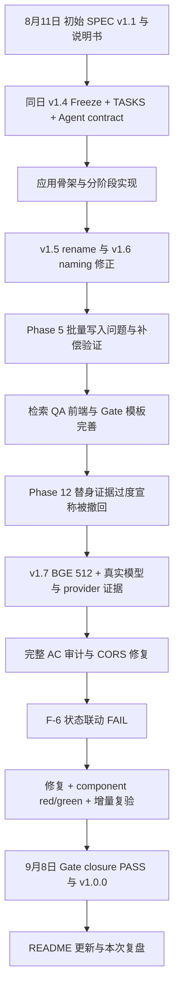
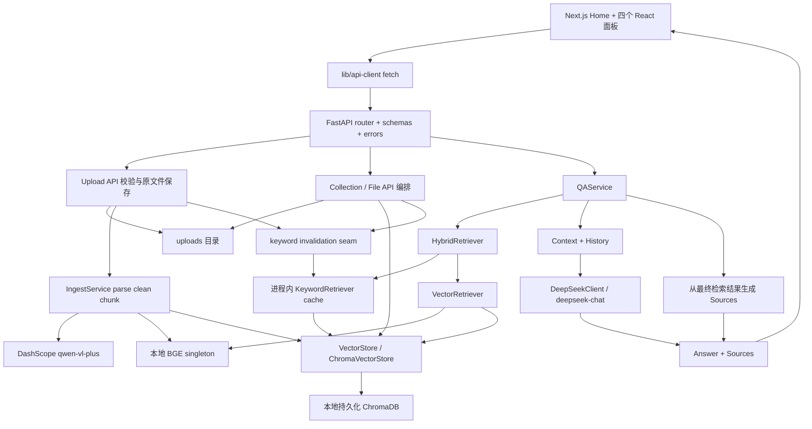
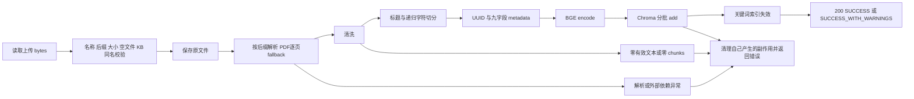
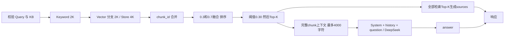
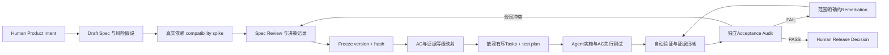

# DX-RAG v1 — Development Retrospective

> Project Engineering Audit + Development Methodology Retrospective  
> 审计日期：2026-09-08；基线：`64b2473be0a552f2ce79cdbc6fd8d1d281e5db75`。  
> 发布 tag：`v1.0.0` → `da8be59a60d7f35a2e3c1ab835624946c53d2a55`；HEAD 比 tag 多一次 README 更新。  
> 本文是工程取证复盘，不是新一轮正式 Phase Gate，也不修改既有验收裁决。

## Executive Summary

DX-RAG v1 实现了面向本地/可信网络的 **Document RAG**：11 种格式上传、解析与 OCR fallback、文本切分、本地 BGE embedding、ChromaDB 持久化、关键词与向量融合、DeepSeek 问答及检索来源展示，并提供知识库和文件管理界面。它可作为 Developer RAG 的文档检索基础，但尚不是 Coding Agent Context Engine：没有代码语法、符号、仓库版本、依赖关系或 Agent tool contract。

方法论最准确的描述是：**以 Spec-first 为起点、在实现中加强验证和 Gate 治理的 Spec-Driven AI Coding workflow，具有 Agentic workflow 特征**。首个可见提交已包含 SPEC v1.1；v1.4 FROZEN、TASKS 和 CLAUDE.md 在应用骨架之前进入 Git。不能将其叙述为“早期自由编码，中期才补 SPEC”，也不能据此断言仓库之外没有早期实现。

这一判断的核心证据不是文档名称，而是合同对代码的实际约束：v1.5 的 rename metadata contract、v1.6 的名称兼容性修正、v1.7 的 BGE 384→512 维冲突处置；任务引用 AC；测试验证分数、身份和失败副作用；错误的全通过结论被撤回；真实 provider 证据补齐；F-6 前端状态缺陷经历失败、修复、复验和独立 Gate closure。

当前历史发布记录为 **PHASE_12_PASS**。本轮重新运行的后端 83 项测试、多个确定性集成脚本、本地真实 BGE probe、前端组件检查、typecheck 和 build 均通过。**本轮未重新调用 DeepSeek/Qwen，也未重跑浏览器上传 E2E。** 历史 provider PASS、当前离线 PASS、发布准备完成和 production-ready 是不同结论。

主要不足是验证策略晚于部分实现成熟：替身曾被当作真实模型/服务的验收证据，源码连线检查曾遗漏真实跨组件状态转移。工程上仍有跨存储补偿而非事务、进程内共享状态、上传异步归属、配置两端漂移、检索质量缺乏数据集评估等边界。

## Project Status Scorecard

| Item | Assessment |
|---|---|
| Current Version / Stage | 发布 v1.0.0；SPEC v1.7 FROZEN；55 Tasks / 13 Phases；历史 Phase 12 PASS |
| Core RAG Pipeline | 已实现；当前确定性集成通过；provider 行为复用历史证据 |
| Ingestion | 11 格式；三态与失败清理；当前 T1201 88/88 |
| Retrieval | 关键词覆盖率 + cosine similarity 固定融合；无正式召回质量基准 |
| QA | 非流式 DeepSeek；当前 adapter/控制流通过，真实回答为历史 LIVE |
| Source Grounding | 后端生成 chunk 身份；是检索来源，非逐句事实归因 |
| Automated Tests | 当前后端 83/83；前端组件 5/5 + 2/2；typecheck/build PASS |
| Spec Completeness | v1 功能合同较强；并发、恢复和输入预算仍不完整 |
| Spec Traceability | 有 task owner、104 个 section-qualified AC occurrence 和证据矩阵 |
| Acceptance Verification | 历史 Gate PASS；本次复核不冒充重新完成全部 LIVE/browser 验收 |
| Production Readiness | Not Ready：不具备公网多用户权限、安全运维和恢复保证 |
| Coding Agent Readiness | Not Ready：开发过程使用 Agent，不代表产品已服务 Coding Agent |
| Development Method | Spec-first、持续演进的 Spec-Driven AI Coding；局部 test-first remediation |

## 1. Project Background

### 审计范围与证据口径

本轮检查了 [README](../README.md)、[CLAUDE.md](../CLAUDE.md)、[SPEC](SPEC.md)、[TASKS](TASKS.md)、[项目说明书](DX-RAG项目说明书.md)，后端 API/core/models/services、前端 app/components/lib、六个后端测试文件、backend/scripts 和 frontend/scripts、依赖声明与环境模板、Git 历史/tag，以及 docs/verification 的验收、Gate、发布和 provenance 文件。对 Phase 0–12 engineering-review 做历史发现巡检，重点交叉核对 Phase 4/5/7/8/9/11/12；学习文档仅作过程证据和导航，不替代源码或执行记录。

检查 Git 可达历史共 26 commits，2026-08-11 至 2026-09-08，仓库不是 shallow clone。使用 `git log --all`、`git log --follow`、`git show --stat`、重点 SPEC/code diff、`git blame`、`git ls-tree` 和 tag 解引用。开始时 `git status --short` 无变更；Git 提示不能读取用户全局 ignore，因此不据此证明忽略目录或用户目录已经完整审计。未读取真实 `.env`、业务 uploads/Chroma 内容或私有证据原件；未安装依赖、修改产品、commit 或 push。

证据标签：

| Label | 本文含义 |
|---|---|
| **Verified** | Git、源码、实际执行或可定位历史 artifact 直接支持；同时说明是当前执行还是历史记录 |
| **Inferred** | 从多个直接事实推导的判断，例如并发风险；不声称已经复现 |
| **Unknown** | 仓库不足以确定，使用 “Repository evidence is insufficient to determine this conclusively.” |
| **Recommendation** | 下一阶段建议，未实施、不属于新增 v1 验收条件 |

产品目标是将课程、技术和内部资料转成可检索知识库。项目说明书的“企业级”属于目标描述；实际边界以 SPEC §2.5、§10.5、§11 和代码为准：单机、可信网络、无认证授权、外部模型服务依赖。

## 2. What DX-RAG v1 Actually Implements

| 能力 | 实际实现与边界 |
|---|---|
| 知识库 | 一个 KB 对应一个 Chroma collection；创建、列出、重命名和级联删除；名称直接作为存储名称 |
| 摄入 | 先校验并保存原文件，再 parse/clean/chunk/embed/store；支持部分 OCR 失败的 warnings |
| 文件管理 | 从 chunk metadata 聚合文件列表；按 file_id 预览/删除；没有文件重命名接口、下载或版本管理 |
| 检索 | 中文 bigram 与英文/数字 token 倒排索引；BGE 向量检索；固定权重与阈值 |
| 问答 | QAService 组装 context/history；OpenAI-compatible SDK 调用 DeepSeek；返回 answer/sources/query/collection_name |
| 前端 | Next.js 单页四面板；Ant Design；React 内置 state；Markdown 展示；来源可展开 |
| 会话 | 最近 20 条消息进入请求；仅前端内存；刷新或切换 KB 清空，不是后端 conversation store |
| 工程支撑 | 集中错误映射、配置模板、可注入测试边界、隔离 Chroma/文件系统验收脚本 |

实际路由为 10 个 method/path 组合：health；upload；query；collections 的 GET/POST/PUT/DELETE；files 的 list/preview/delete。见 [router.py](../backend/app/api/router.py) 及 [API modules](../backend/app/api/collections.py)。没有独立公开 retrieval endpoint、MCP server、repository ingestion 或 Agent 工具注册。

未发现已跟踪 Dockerfile、Compose、CI workflow 或后端 lockfile；前端有 `package-lock.json`。README 提供本地启动命令，不能据此推导已有容器化部署或持续交付管线。

## 3. Development Timeline

日期采用 Git author date（+08:00）；文档内部日期另列，不把它当作 commit 时间。一次 commit 可以包含多个会话的结果，不能从同一提交内部推出严格的逐步操作顺序。

| 时间 / commit | 直接观察 | Label / 能证明什么 |
|---|---|---|
| 2026-08-11 17:46 `b936491` | 初始 tree 只有 `.gitignore`、README、项目说明书、SPEC v1.1；无 backend/frontend 应用文件 | Verified：可见历史从规格文档开始；说明书内的示例代码不是独立可运行实现 |
| 2026-08-11 21:02 `9b2b438` | SPEC 升至 v1.4 FROZEN；首次加入 TASKS（54 tasks）和 CLAUDE.md | Verified：任务分解和 Agent contract 早于应用骨架；v1.2/v1.3 是文档记述的中间修订，未见独立对应提交 |
| 2026-08-11 21:49 `3db1b5e` | FastAPI/Next.js skeleton | Verified：现存应用源文件晚于前述规格提交 |
| 2026-08-11～12 `beaf705`、`99cb486`、`a1976ed`、`adba4b7` | config、errors、schemas、Agent 状态来源规则和学习记录 | Verified：基础合同逐步落实 |
| 2026-08-12～19 `928e203`、`5c2b64e`、`a479552` | VectorStore 建立和完善；v1.5 rename metadata contract；health task 补充 | Verified：SPEC patch 与接口完善共同演进；当前 task 数增至 55 |
| 2026-08-20 `bb75e33`；08-23 `6f80217` | embedding、ingest 首次加入 | Verified：核心摄入在 frozen spec 后实现；不保证当时真实模型已验收 |
| 2026-08-24 `582d722` | Phase 0–3 engineering-review、模板和项目地图加入 | Verified：复盘资料体系后续扩展 |
| 2026-08-25 `a371a5a` | collection API；SPEC v1.6 名称兼容性修正 | Verified：原允许中文名称与 Chroma 约束冲突，合同改为 ASCII canonical regex |
| 2026-08-26 `a76c5a4` | upload API、rollback probe、批次持久化与补偿 | Verified：Phase 5 记录 5461 chunk 单批限制导致 FAIL；同一提交收录修复，不能给每一步虚构 commit |
| 2026-08-27 `33e0bdb`；08-28 `5b61a86` | 修正分词示例；关键词检索/test；canonical Gate 和 Learning workflow 模板加入 | Verified：Gate 规范文档首次可见时间；不能说之前没有 Gate 活动 |
| 2026-09-02 `790f39f`、`59293af` | vector/hybrid retrieval、LLM QA/query 和测试 | Verified：任务/实现顺序与依赖链主要一致 |
| 2026-09-04 `df5dc90`、`006453c` | files API、缓存提交边界/固定权重等 SPEC 澄清；前端基础 | Verified：并非所有合同在最初 freeze 后一字不变 |
| 2026-09-07 `0132002`、`f41716a` | 前端 features；Phase 12 scripts/audit；SPEC v1.7 与 embedding 512 guard | Verified：真实依赖暴露冻结规格错误；provider 当时仍有证据缺口 |
| 文档记述 09-07，提交 09-08 `da8be59` | LIVE artifacts、完整 AC matrix、CORS/PDF 修复、F-6 修复及增量复验、发布和脱敏记录 | Verified：多个验收事件集中入库；活动日期与入库日期分开 |
| 2026-09-08 `da8be59` / `v1.0.0` | 发布提交与 annotated tag；Gate closure 记录 PHASE_12_PASS | Verified：存在发布标签；closure 是对已有独立评审的文档记录，不是原始对话全文 |
| 2026-09-08 `64b2473` | 重写 README | Verified：当前 HEAD；产品代码与 tag 相同 |

**Gap Analysis 的边界：**初始 SPEC 已称来源包含 “Phase 1 Gap Analysis”，当前 §14 记录 Freeze/patch 决策。但未发现独立 Gap Analysis 文件或可分离的原始讨论提交；项目说明书标注的“2026年5月”也不能证明五月已有运行系统。它与实现阶段的 “Phase 1 VectorStore” 不是可直接等同的事件。确切分析时间、参与者和仓库外 prototype：**Unknown — Repository evidence is insufficient to determine this conclusively.**

图中同一发布提交包含的内部顺序来自具名 artifacts，不是逐项 commit 的独立证明。

## 4. Is DX-RAG Spec-Driven?

本文将 Spec-Driven 定义为“规格在实现和验收中拥有实际裁决作用”，不要求永不修订，也不以工具品牌判断。

| Dimension | Evidence | Assessment |
|---|---|---|
| Explicit Specification | SPEC F001–F017，输入/流程/Determine，API/schema/error | Strong |
| Spec as Source of Truth | SPEC §1；CLAUDE 优先级；名称/BGE 冲突要求产品决策 | Strong |
| Task Decomposition | TASKS 的 dependencies、scope、AC、completion；55 tasks | Strong |
| Agent Constraints | 单 task、禁止未来工作/静默决策、读取依赖和 diff review | Strong |
| Acceptance Criteria | §5 + §12 Given/When/Then；104 个独立出现位置 | Strong |
| Definition of Done | Mandatory DOD-01～06；DONE 以验证为前提 | Strong |
| Implementation Traceability | TASKS §19/20 + acceptance matrix 指向代码、owner、evidence | Strong |
| Automated Verification | 当前真实执行通过；脚本含实际存储与显式替身边界 | Strong |
| Acceptance Gate | canonical protocol；Phase 12 FAIL、增量 re-review、closure | Strong |
| Failure / Remediation Loop | 5461 批量限制、BGE 冲突、CORS、F-6 red/green | Strong |
| Spec Evolution Control | v1.5/1.6/1.7 有决策记录；但 v1.6 内也有实质澄清，Agent 文件版本滞后 | Moderate |
| Human Decision Boundary | 冲突上报/禁止 Agent 自决；BGE 产品授权记录；缺少完整审批会话与统一签署记录 | Moderate |

这超过“只有一份说明文档的 AI-assisted coding”。但 Strong 表示本仓库内存在实质证据，不能读作所有任务、所有执行会话均完全合规，也不代表统计质量或生产安全。

## 5. Specification Architecture

规格体系有明确分工：项目说明书提供概念与示例；SPEC 定义产品行为；TASKS 把功能和 AC 分给依赖有序的任务；CLAUDE 定义 Agent 执行纪律；Gate protocol 定义独立裁决；learning/engineering-review 解释原理和风险；verification 保存事实结果。

SPEC §5 的 Define/Detail/Determine、§6 API、§7 identity/data、§8 config、§9 errors、§10 security、§12 cross-feature AC、§13 DoD 共同组成合同。§15 coverage 表是导航，不能覆盖显式 AC 原文。当前 §5 有 65 个 AC occurrence，§12 有 39 个，共 104 个；去重后 85 个 ID。F003 等 ID 跨 section 复用而内容不同，必须按 **section + AC ID** 追踪。

SPEC 的 “FROZEN” 实际含义是普通实现不能自行修改产品决策，不是从此禁止修订。`a479552`、`a371a5a`、`f41716a` 显示合同修正；`33e0bdb` 修分词示例，`df5dc90` 补上传大小写、cache post-commit、error envelope 和固定权重等澄清。后两者未各自升级顶层版本，形成 version-only 追踪的不足。

## 6. Spec → Task → Code → Test Traceability

完整逐项历史账本见 [104-row matrix](verification/T1204/ACCEPTANCE-MATRIX.md)、[机器可读原文](verification/T1204/acceptance-matrix.json) 和 [DoD matrix](verification/T1204/DOD-MATRIX.md)。下表按能力汇总，不把检查数相加当作覆盖率。

测试简称：U = `backend/tests/`；I1 = `verify_t1201_ingestion.py`；R2 = `verify_t1202_retrieval_qa.py`；F3 = `verify_t1203_file_management_security.py`；A4 = `verify_t1204_spec_acceptance.py`；RB = `verify_t0503_rollback.py`；BGE = `verify_bge_model.py`，脚本均位于 `backend/scripts/`。所有这些脚本本轮均已执行。LIVE1/2 指 `docs/verification/T1201/live-final.txt` / `T1202/live-reviewed.txt`，仅为历史。

Final Status：✅ Verified = 表列合同在所述测试范围获直接支持；🟡 Partially Verified = 关键边界只获历史或局部验证；⚠️ Implemented but Weakly Verified = 有代码、缺对应充分执行；⏳ Deferred = 明确 v1 排除；❌ Missing = 产品能力不存在；🔄 Deviated from Spec = 有明确合同偏离。Verified 不含任意输入、并发或崩溃保证。

| Capability / Spec | Spec Reference | Task Reference | Implementation | Test / Verification | Final Status |
|---|---|---|---|---|---|
| KB create/list/隔离 | F001；§6.5；§12.1 | T0401/03/04 | `api/collections.py`，`core/vector_store.py` | A4 名称/CRUD；F3 跨 KB；历史 matrix | ✅ Verified |
| KB rename identity/cascade | F001 AC-04/06；F008；§7.1 | T0402；T0103 | `rename_collection`、`_verify_rename`、补偿函数 | A4 正常/故障；F3；component mutation | ✅ Verified（单故障范围） |
| upload | F002；§6.3 | T0502 | `api/upload.py:upload_file` | I1 + F3 + F-6 | ✅ Verified |
| validation/duplicate | F002；§10.2；AC-SEC-01/02 | T0501 | `validate_upload`、`validate_file_name` | U/test_upload、I1、F3 | ✅ Verified |
| TXT/CSV/JSON/LOG | F003 §3.1；§5 AC-F003-01/02 | T0301 | `ingest.py:parse_text_file` | I1 编码与纯文本 fixtures | ✅ Verified |
| Markdown | F003/F006 | T0301/07 | `parse_text_file`、`chunk_text` | I1 标题与字符片段 | ✅ Verified |
| DOCX | F003 §3.3；§5 AC-F003-04 | T0302 | `parse_docx_file` | I1 段落与表格 | ✅ Verified |
| Excel 四后缀 | F003 §3.4；§5 AC-F003-05 | T0303 | `parse_excel_file` | I1 多 sheet、空值、后缀分派 | ✅ Verified |
| PDF native/corrupt/encrypted | F003 §3.2；§12.3 | T0304 | `parse_pdf_file` | I1；U/test_upload；A4 | ✅ Verified |
| OCR fallback | F004；AC-F004-01～05 | T0305/08 | `ocr_page`、warnings | I1/A4 adapter faults + 历史 LIVE1 91/91 | 🟡 Partially Verified（本次无 LIVE） |
| cleaning | F005 AC-01/02 | T0306 | `clean_text` | I1 空白及失败清理 | ✅ Verified |
| chunking/UUID | F006；§7.1 | T0307 | `chunk_text` | I1 800/120、标题、短文本与 metadata | ✅ Verified |
| embedding | F007；§7.4 | T0201/02 | `embedding.py` | U/test_embedding；真实 BGE 4/4 | ✅ Verified（固定本地快照） |
| vector persistence/search | F008 AC-01/03 | T0101/04/05/08 | `ChromaVectorStore` | A4、I1、真实 BGE/Chroma | ✅ Verified |
| keyword index/tokenization | F009 AC-01～05 | T0601/02 | `qa.py:KeywordRetriever` | U/test_qa + R2 | ✅ Verified（单进程） |
| vector retrieval | F010 AC-01/02 | T0701 | `VectorRetriever` | U/test_qa；R2；BGE 语义 fixture | ✅ Verified（非 recall benchmark） |
| hybrid/score fusion | F011 AC-01/04 | T0702/03 | `HybridRetriever`、`retrieve` | U/test_qa、R2 精确分数/去重 | ✅ Verified |
| relevance filter/Top-K | F011 AC-02/03 | T0702 | `hybrid_search` | U/test_qa、R2 先过滤后截断 | ✅ Verified |
| context construction | F012；AC-QA-07 | T0801 | `assemble_context` | U/test_qa、R2 整 chunk 停止 | ✅ Verified |
| LLM QA/retry | F013；AC-QA；§9.3 | T0803/04/05 | `DeepSeekClient`、`QAService`、query API | U、R2、failure contract；历史 LIVE2 70/70 | 🟡 Partially Verified（本次无 LIVE） |
| source identity/shape | F015 AC-01/02 | T0801 | `assemble_sources` | U/test_qa；R2；历史 LIVE2 | ✅ Verified（retrieved sources） |
| 答案事实 grounding/injection | F013 AC-01～03 | T0803/04；T1202 | `SYSTEM_PROMPT` | 历史 LIVE2 样例；本轮仅 prompt/adapter | 🟡 Partially Verified |
| history | F014；AC-QA-03 | T0802；T1103/05 | `process_history`、QAPanel | U 窗口/格式；component；历史 LIVE 指代 | 🟡 Partially Verified |
| file list/preview | F016；§12.6 | T0901/02 | `api/files.py` | U/test_files；F3；A4 | ✅ Verified |
| file delete/re-upload | F016；§12 AC-F016-08/09 | T0903；T1203 | `delete_file` + vector delete | F3、RB、F-6 lifecycle | ✅ Verified（成功路径/已测错误） |
| rollback | F002；§12 AC-F002-08～10 | T0503；T0104 | upload cleanup、ingest `_fail`、partial-add compensation | RB、I1 故障后无残留/重传 | ✅ Verified（非 crash-safe） |
| CORS | §8.1/10.3 | T0001/03；T1204 | `main.py` middleware | U/test_cors、A4 | ✅ Verified |
| error handling | §6.7/9 | T0004 + feature owners | `core/errors.py`、`main.py` | U/API suites、A4、failure contract | ✅ Verified（列举合同） |
| frontend | F017；AC-FE | T1001/02；T1101～05 | app/page + 四 components + api-client | 当前 5/5、2/2、typecheck/build；历史 browser 6/6 | 🟡 Partially Verified（无真实浏览器上传） |
| configuration | §8.1 | T0003 | `config.py`、`.env.example`、frontend constants | A4 静态/default checks、CORS；自定义跨端配置未覆盖 | 🟡 Partially Verified |
| verification system | §12/13 | T1201～04 | tests/scripts/matrices | 本轮执行 + 历史 Gate/evidence | ✅ Verified（声明的范围） |
| security boundary | §10 | T0501；T1203 | basename/路径范围校验、backend secrets、prompt | F3 + U；prompt 历史 fixture | 🟡 Partially Verified（无权限体系） |
| auth/streaming/server history | §2.5 | 无 v1 task | 无 | 静态核对 TASKS §22 | ⏳ Deferred |
| code intelligence/MCP | 未定义 v1 合同 | 无 | 无 | 源码/文件清单核对 | ❌ Missing（不是 v1 AC 缺陷） |

表中后端实现路径以 `backend/app/` 为根。单项测试文件未覆盖所有底层服务：parsing、collection、storage 的大量验证位于 scripts，不能只统计 unittest 文件推断这些能力没有测试。

## 7. Final System Architecture

API 层处理 HTTP、校验和部分业务编排；IngestService 与 QAService 聚合流水线；VectorStore 的 11-method interface 隔离 Chroma 操作和 raw distance。分层不是严格的 dependency-inversion 全覆盖：上传/管理 API 直接构造 ChromaVectorStore，keyword invalidation 延迟导入 qa 中的 retriever；QAService 可以注入依赖，测试性更好。

持久状态有原文件和 Chroma chunks/vectors/metadata；文件记录是 metadata 投影，不存在单独 SQL 文件表。关键词索引和模型 singleton 为进程内状态，前端 history/selection/count 也是内存状态。关键词索引丢失后可由 Chroma 重建，但多个 worker 之间没有失效广播。

BGE 本地运行；Qwen 接收无原生文本 PDF 页的图片；DeepSeek 接收问题、历史和入选上下文。文件本地持久化不等于所有内容均不离开机器。当前 health 只返回 `status=ok`，不会加载模型或检查 provider 可用性。

## 8. Ingestion Pipeline

### 格式、校验与解析

支持 `.txt/.md/.csv/.json/.log/.pdf/.docx/.xlsx/.xlsm/.xltx/.xltm`。后缀忽略大小写；同一 KB 内同名忽略大小写，跨库允许。没有内容 hash dedup 或文件版本。名称通过 `PureWindowsPath(...).name == file_name` 等拒绝路径成分，不静默改名。50 MB 实际按 `50 * 1024 * 1024` bytes；等于上限允许，超过为 413，0 byte 为 400。多个条件同时无效时，SPEC 不冻结优先级；所有目标文件写入必须晚于前置校验。

入口先 `file.file.read()`，因此“拒绝超大文件”不等于读取前有严格内存限额。默认 collection `knowledge_chunks` 必须已存在；启动阶段不自动创建默认 KB。

| Parser | 当前策略 | 保留的限制 |
|---|---|---|
| Text | UTF-8 strict → UTF-16 strict → GBK `errors=ignore` | GBK fallback 可丢不可解码字节；CSV/JSON 不结构化 |
| DOCX | 所有段落文本，再拼接所有表格；行内 cells 空格分隔 | 原始段落/表格交错布局不保持 |
| Excel | openpyxl `data_only=True`；遍历 sheets，跳过空值/空行/空 sheet | 使用已有公式缓存；不计算公式、不执行宏；不保留二维表语义 |
| PDF | PyMuPDF 从 bytes 打开；逐页 `get_text()`；原生文本为空才 OCR | 同一页已有文本时不增强识别图片文字；加密文件拒绝 |
| OCR | page pixmap → JPEG/Base64 data URI → `qwen-vl-plus` | 页级重试/警告；不保存页码到 chunk source |

OCR 默认最多 3 次总尝试，退避 1/2 秒；网络异常、429、5xx 重试，401/403 立即 `OCR_AUTH_FAILED`；缺 key 为 `OCR_NOT_CONFIGURED`。渲染失败或重试耗尽记录 `{page_number,error_code}` 并跳页。有效 chunks > 0 且有 warnings 为 SUCCESS_WITH_WARNINGS；全空经 `_fail` 清理并由 upload 转为 422 FILE_PARSE_ERROR，warnings 保留在 `error.details.warnings`。

### 清洗、切分和持久化参数

`clean_text` 做 splitlines → 每行 strip → 删除空行 → 用换行拼接；不删除 HTML、检测语言或脱敏。它会去掉行首缩进，这是后续代码文档检索需要重新评估的行为。

所有文件都尝试 Markdown `#`～`####` 标题切分；以 `标题 > 子标题` 为路径前缀。候选超过 800 字符才递归切分，overlap=120；短候选不合并。分隔优先级为 `\n\n`、`\n`、`。`、`！`、`？`、`；`、`，`、空格、空字符串。overlap 由递归 splitter 控制，不表示不同标题段之间必有 120 字符重复。

file_id 每次摄入 UUID4；chunk_id 每片 UUID4；chunk_index 从 0 开始。九字段 metadata 为 `chunk_id,file_id,file_name,collection_name,chunk_index,source_file,file_size,upload_time,ingestion_status`。`source_file` 固定使用逻辑字符串 `uploads/{collection}/{file_name}`，实际目录取 `UPLOAD_DIR`；不是随配置变化的真实绝对路径。upload_time 为 UTC ISO timestamp。

BGE lazy singleton；`normalize_embeddings=True`；`EMBEDDING_DIMENSION=512`，编码结果检查数量和维度。仅维度 guard 不能识别任意另一 512 维模型。Chroma 使用 cosine/HNSW、本地 PersistentClient，文本和 embedding 显式传入。add 按公开 `get_max_batch_size()` 分批，fallback=5461；它是传输上限，不是产品允许的最大 chunk 数。

### Rollback 与状态边界

保存原文件的 upload 层负责异常时清理原文件；零文本/零 chunks 的 `_fail` 清理文件和 file_id 对应向量；VectorStore 负责批次写入中途失败的 file_id-scoped compensation；durable commit 后 index invalidation 失败则标 dirty，不应反报上传失败。

这些是**应用层补偿**。`_discard_saved_file`、`_compensate_partial_add` 和 rename restore 的二次失败只记录日志；无跨文件系统/Chroma 的事务或 crash recovery。当前 tests 证明受控单故障路径，不证明存储故障同时破坏清理时仍满足“绝无残留”。并发同名检查与写入之间也没有锁/幂等令牌，这是静态风险，不是本轮实测的数据损坏。

## 9. Retrieval & QA Pipeline

实际 QA API 先验证 question、collection_name、整数 top_k（拒绝 bool）、history 格式；不存在 KB 返回 404，空 KB 返回 409 COLLECTION_EMPTY 且不调用 LLM。非空 KB 的检索为空，仍调用 LLM 并返回空 sources。

| 步骤 | 真实算法与参数 |
|---|---|
| Tokenize | 英文/数字 `[a-zA-Z0-9]+` 转小写；连续中文片段做 bigram；丢弃长度 <2 token；按首次出现去重 |
| Keyword index | collection-scoped class dictionaries；lazy 全量 `list_chunks` 建倒排；upload/delete/rename 标 dirty |
| Keyword score | 命中的 unique query tokens 数 / unique query tokens 总数；不是 BM25/TF-IDF |
| Vector | 同一 BGE 编码 query；Chroma cosine；`clamp(1-distance,0,1)`；不做二次 min-max |
| 召回倍数 | Hybrid 各请求 2K；VectorRetriever 再向 Store 请求两倍，因此 QA 的 Chroma 请求为 4K，vector 分支返回 2K |
| Merge | 按 chunk_id；缺失一路为 0；同一路重复记录取该分数最大值 |
| Fusion | `0.3 * keyword_score + 0.7 * vector_score`；内部固定，不是配置输入 |
| Filter/Top-K | 排序 DESC → 保留分数 ≥0.30 → Top-K；K 默认 5，API 允许 1–20 |
| Context | 分数顺序完整 chunk；含来源头和分隔符最多 4000 字符；下一片放不下则停止，不尝试后面更短片段 |
| History | 验证 user/assistant + string；仅最近 20 条；无消息字符/token 总预算 |
| LLM | `deepseek-chat`，base URL `https://api.deepseek.com`；temperature=0.2，max_tokens=2048，stream=false |
| Retry | SDK max_retries=0；应用最多 2 retry，总 3 次；1/2 秒退避；单次 timeout=60 秒；不是整条 QA deadline |
| Sources | 最终检索 Top-K 的 file_id/file_name/chunk_id/relevance_score，降序；同一文件多个 chunks 均保留 |

当前两路调用顺序执行；SPEC F011 Detail 明确允许“并行（或顺序）”，因此不是性能合同违规。分数在数值区间相同不代表经过统计校准，也不意味着 relevance_score 是正确性概率。纯 keyword 候选在默认阈值下只有 keyword_score=1 才能达到 0.30；这是冻结权重/阈值的实际效果，需用评估数据决定下一版是否改变。

`assemble_sources(results)` 不使用 context 实际入选列表，故 sources 可能包含没送入 LLM 的 chunks。这符合 F015 Detail 的检索结果定义，但不足以宣称逐句 grounding。system prompt 要求不得凭空回答、历史不作事实源、检索指令不得覆盖系统规则；没有输出事实校验器或通用 prompt-injection 防护保证。

## 10. Key Engineering Decisions

### Decision: ChromaDB + metadata 投影

**Decision：**一个 KB 一个 collection；文件列表由 chunks 聚合；原文件另存 uploads。  
**Evidence：**SPEC F008/§7.3；[vector_store.py](../backend/app/core/vector_store.py)。  
**Rationale：**SPEC 明确不引入额外 metadata DB，并保留 VectorStore 供未来 Milvus 扩展；为何最初在全部候选数据库中选择 Chroma，The repository does not explicitly document the rationale.  
**Trade-off：**部署少一个业务数据库，FAILED 无 chunks 时不会投影出文件；list/get_files 和重建索引遍历全部 chunks，且原文件与 Chroma 仍需协调。

### Decision: 本地 BGE lazy singleton，保留模型而修正维度

**Decision：**保留 BAAI/bge-small-zh-v1.5；512 维、L2 normalized；第一次使用才加载。  
**Evidence：**SPEC F007/§14 v1.7；`f41716a`；[embedding.py](../backend/app/services/embedding.py)；[BGE 历史审计](T1204-SPEC-ACCEPTANCE-AUDIT.md)。  
**Rationale：**合同明示避免反复加载、模型问题不阻断基础启动；v1.7 明示产品授权保留模型而不换替代模型。  
**Trade-off：**本地 inference 和缓存降低重复开销；首次请求承担加载时间，部署需模型快照；旧维度数据需要受控重建，当前没有自动 migration 工具。

### Decision: 固定 hybrid fusion

**Decision：**关键词 0.3、向量 0.7、阈值 0.30；以 chunk_id 融合。  
**Evidence：**SPEC F009–F011；[qa.py](../backend/app/services/qa.py)；`df5dc90` 澄清固定输入边界。  
**Rationale：**SPEC 记录单路检索有盲区、扩大召回让融合改变排名；具体 0.3/0.7/0.30 的实验选择依据，The repository does not explicitly document the rationale.  
**Trade-off：**可预测、易写精确合同测试；不是经过语料优化的排序方案，不能从公式正确推出召回质量好。

### Decision: Native-first PDF + Qwen fallback

**Decision：**只对 native text 为空的页面调用 `qwen-vl-plus`；页失败容错并暴露 warnings。  
**Evidence：**SPEC F003/F004；[ingest.py](../backend/app/services/ingest.py)；LIVE1。  
**Rationale：**SPEC 定义图片页文字提取与有效页面保留的需求；具体 provider 相对其他 OCR 的选型比较未记录。  
**Trade-off：**文本页无需视觉调用；mixed-content 同页图文不完整，结果受 provider/network 影响，页图会发往外部。

### Decision: DeepSeek adapter 自管重试

**Decision：**OpenAI-compatible SDK、`deepseek-chat`、关闭 SDK 内建 retry、应用限次退避。  
**Evidence：**SPEC F013/§9.3；`DeepSeekClient`；[Phase 12 engineering review](learning/engineering-review/phase-12-engineering-review.md)。  
**Rationale：**工程记录明确避免 SDK 与应用重试相乘；具体选择 DeepSeek 的比较依据，The repository does not explicitly document the rationale.  
**Trade-off：**错误码和总尝试数易验证；同步等待，无整体 deadline、取消、熔断或流式响应。

### Decision: Sources 由后端生成

**Decision：**来源身份来自检索数据，不由 LLM 生成；不输出内联引用标记。  
**Evidence：**SPEC F015；`assemble_sources`；U/test_qa source tests。  
**Rationale：**SPEC 明确避免模型虚构来源。  
**Trade-off：**身份与分数可校验；不能证明回答逐句使用了这些来源，且与截断后 context 有差异。

### Decision: 分层副作用 ownership + 补偿

**Decision：**upload 清文件、VectorStore 清部分批次、rename 分层补偿；keyword 失效在 durable commit 后。  
**Evidence：**SPEC F002/F008/F009；`a76c5a4`、`df5dc90`；RB、F3、A4。  
**Rationale：**代码/复盘明确避免缓存失败把已持久化成功反报失败，并避免批次失败遗留半文件。  
**Trade-off：**恢复逻辑贴近副作用 owner；不是事务，补偿失败/进程中断仍有不一致窗口。

## 11. Spec vs Implementation Deviations

| Area | Spec / Documentation | Actual Implementation | Impact | Status |
|---|---|---|---|---|
| Version | README/tag 为 v1.0.0 | FastAPI 和 package.json 为 0.1.0 | 运维/用户看到的版本不一致 | Open，展示 drift；README 已披露 |
| Agent baseline | SPEC v1.7 | CLAUDE 仍称 v1.6 | Agent 可能误读规格状态，虽优先级要求以 SPEC 为准 | Open |
| Task phase/status | 55 个 task entries 已 DONE | TASKS 顶部/尾部仍 READY FOR IMPLEMENTATION，Updated 列表滞后 | 初读者容易误判阶段 | Open |
| UI phase | Phase 12 已闭环 | page.tsx 仍 Phase 10/application shell/SHELL READY | 展示与状态不符 | Open |
| AC 导航计数 | §15 表称 F003 有3、F012有3、F017有5等 | 显式 Determine 分别为5、2、4；全局104 occurrences | 不能用导航表直接验收 | Open，matrix 已按原文规避 |
| Spec version granularity | FROZEN/version 标签 | v1.6 内分词示例和后续多个合同澄清 | 相同版本名可指不同合同字节 | Open，需 commit/hash 定位 |
| Custom upload limit | backend MAX_UPLOAD_SIZE_MB 可配置；前后端校验 | frontend 固定50及对应提示 | 改成100时 UI 拦截；改小则 UI 放行后 backend 拒绝 | 条件性跨端配置缺口，默认一致 |
| Custom history window | backend MAX_HISTORY_LENGTH 可配置 | QAPanel 固定最近20条 | 调大后 frontend 仍只发送20 | 条件性跨端配置缺口 |
| source_file | metadata 使用 `uploads/...` | 实际原文件位置可由 UPLOAD_DIR 改变 | 应当理解为逻辑 metadata；不能当真实路径 | 已实现且遵循字面合同 |
| Source semantics | F015 概述容易读成实际引用 | sources 来自检索Top-K，不是 context 子集 | 可出现未供模型阅读的来源 | 合同内已知边界，不标字段 bug |
| Parallel wording | F011 Define 写并行，Detail 允许顺序 | 实际同步顺序调用 | 非规范化概述容易误导性能判断 | 不违反 Detail |
| Models | 旧 SPEC 384 | 当前512 guard，与v1.7一致 | 旧向量数据不可混用 | Resolved；业务数据迁移未核验 |
| CORS | origins 可配置 | main 已消费 settings.CORS_ORIGINS | 原固定星号问题已修复 | Resolved；本轮测试通过 |
| API/errors | §6、§9 | 已实现对应方法/错误码；validation 使用统一422 envelope | 原框架验证漂移已澄清并测试 | 核查通过，限已定义 API |
| Formats/ports | README 11格式，3000/8000 | whitelist/dispatch一致；Next默认3000，client默认8000/api | 未发现默认值冲突；后端端口由启动命令决定 | 核查通过 |
| Persistence/preview | chunk-based preview，5000字符 | metadata投影，按chunk_index拼接再截断 | overlap重复、标题重构不等于原文件预览 | 核查通过，局限明确 |
| Frontend synchronization | F002/F017 成功上传后可见 | 已有 callback + per-KB fileRevisions | 旧F-6已修复；上传中改KB另有风险 | Resolved within F-6 scope |

这些发现不把所有文档瑕疵升级为历史 Gate blocker；也不因为历史 Gate PASS 而删除当前源码可见边界。

## 12. Testing & Verification

### 本轮实际执行（2026-09-08）

环境：Windows PowerShell；Python 3.14.6；Node v24.18.0；FastAPI 0.141.1、ChromaDB 1.5.9、sentence-transformers 6.0.1、torch 2.14.0、PyMuPDF 1.28.2、httpx 0.28.1、pydantic-settings 2.15.0。这些是本机已安装版本，不是仓库锁定的支持矩阵。

后端通过 Python wrapper 启动：工作目录为新建空临时目录，`PYTHONPATH=<repo>/backend`，`PYTHONDONTWRITEBYTECODE=1`、`PYTHONIOENCODING=utf-8`、`ANONYMIZED_TELEMETRY=False`、HF/Transformers offline；子进程环境去除两项 provider keys。测试目标使用绝对路径；scripts 自己把 storage 重定向到临时树。无 `--live`，没有读取 backend/.env，也没有访问业务数据。下表用相对路径便于阅读；实际运行在上述隔离 cwd。

| Command | Result | 当前证据边界 |
|---|---|---|
| `python -B -m unittest discover -s <repo>/backend/tests -v` | 83 tests，OK，exit 0；7.894s | 六个测试文件；无失败/skip报告；外部依赖按测试注入 |
| `python -B <repo>/backend/scripts/verify_t0503_rollback.py` | RESULT: PASS，exit 0 | 当前回滚脚本成功；历史完整记录为56/56；本轮摘要过滤未保留计数，不伪造新的计数输出 |
| `python -B <repo>/backend/scripts/verify_t1201_ingestion.py` | 88/88，exit 0 | 真实解析/临时存储；BGE和Qwen替身 |
| `python -B <repo>/backend/scripts/verify_t1202_retrieval_qa.py` | 46/46，exit 0 | 真实应用/临时Chroma；embedding/transport替身 |
| `python -B <repo>/backend/scripts/verify_t1202_failure_contract.py` | exit 0 | 脚本15项全真才返回0；当前摘要未展开JSON；零provider请求 |
| `python -B <repo>/backend/scripts/verify_t1203_file_management_security.py` | 43/43，exit 0 | 真实API/临时存储；embedding替身 |
| `python -B <repo>/backend/scripts/verify_t1204_spec_acceptance.py` | 42/42，exit 0 | 扩展合同探针；不等于重新执行104个LIVE/browser AC |
| `python -B <repo>/backend/scripts/verify_bge_model.py` | 4/4，exit 0 | 真实本地BGE+临时Chroma；revision `7999e1d3359715c523056ef9478215996d62a620` |
| frontend: `node scripts/verify_f6_integration.cjs` | 5/5，exit 0 | 实际Home/四组件，MOCKED API/hooks scheduler；非browser DOM |
| frontend: `node scripts/verify_t1204_contracts.cjs` | 2/2，exit 0 | 51MiB拒绝、50MiB通过前置校验；没有真正发送50MiB |
| frontend: `node node_modules/typescript/bin/tsc --noEmit --incremental false` | exit 0，无诊断 | Typecheck |
| frontend: `npm.cmd run build` | exit 0；4/4 static pages | Next 14.2.24 编译、类型检查和生产构建；不是独立lint套件 |

没有把不同层的 pass 数求和：同一合同会在 unit/integration/AC 中重复出现。`package.json` 无 test/lint scripts，不代表没有前端验证——已有两个独立 Node probes；反过来 build 的类型检查也不证明交互正确。

### 历史结果与本轮完整性核查

| 历史 artifact | 记录结果 | 不能推导的结论 |
|---|---|---|
| [T1201 LIVE](verification/T1201/live-final.txt) | 91/91；真实 Qwen、本地BGE/Chroma；含受控transport失败 | 本轮provider仍可用；所有PDF的OCR质量 |
| [T1202 LIVE](verification/T1202/live-reviewed.txt) | 70/70 checks；保留历史 exit 2 | exit 2 不能篡改成0；并未自然观察429/5xx/403 |
| [Browser](verification/T1204/browser.md) | 历史6/6场景，真实文件选择受限 | 浏览器上传E2E全部通过 |
| [F6 results](verification/T1204/F6-RESULTS.json) | red/green与5/5组件集成 | 原生React调度、AntD DOM事件、真实HTTP全链路已验证 |
| [104-row matrix](verification/T1204/acceptance-matrix.json) | 本轮解析确认65+39=104，85独立ID，104行结果字段PASS | 解析PASS字段不是重新执行每条AC |
| [Sanitization manifest](verification/sanitization-provenance.json) | 本轮校验17/17 public SHA-256吻合 | 不证明未读取的original→public转换只改路径，也不证明provider真实性本身 |

临时取证脚本曾因 PowerShell→Python 中文编码及 stdout GBK 失败；修正为 ASCII 脚本/UTF-8 输出后完成矩阵和哈希核查。这是审计辅助命令问题，不是产品测试失败。未增加或修改任何测试以得到 PASS。本轮执行摘要保存在本文；没有额外创建一套项目测试日志文件。

## 13. Acceptance Audit History

### 真实的 FAIL → remediation → verification

| 事件 | 初始缺口/失败 | 修复或证据补齐 | 结果及证据强度 |
|---|---|---|---|
| Phase 5 | 合法上传产生 >5461 chunks 时单次 Chroma add 失败；部分批次残留风险 | 分批add、file_id补偿；V9/V10从GUARD转为CHECK | [Phase 5 review](learning/engineering-review/phase-05-engineering-review.md)、RB与`a76c5a4`；修复可核查，不能把review中的待Gate项自动写成当时已PASS |
| Phase 12 原始总审计 | 用BGE/Qwen/DeepSeek doubles支持“100% mandatory PASS” | 撤回结论；T1201/02/04恢复BLOCKED | [历史审计](T1204-SPEC-ACCEPTANCE-AUDIT.md)：verification defect，不是所有代码都不存在 |
| F-1 BGE | 未加载真实模型；冻结规格384与模型512冲突 | 产品授权v1.7；保持原模型；512 guard及真实4/4 | `f41716a` + BGE artifact；spec defect + verification gap |
| F-2 OCR | F004 literal OCR依赖未证实 | 真实Qwen、PDF fixtures、受控真实transport超时；发现并修复Windows corrupt PDF句柄影响回滚 | LIVE1 91/91；`ingest.py` bytes-open及U/test_upload；provider gap + implementation defect |
| F-3 QA | F013回答、F014指代、grounding/injection只有替身 | DeepSeek真实响应与401；真实SDK受控超时/连接错误；deterministic retry faults | LIVE2 + [blocker audit](verification/T1202/BLOCKER-AUDIT.md)；provider gap closed at historical scope |
| 自增额外Gate | 未自然出现429/5xx被runner判exit2 | 对照冻结AC确认并无自然观察要求；保留旧exit2与NOT_OBSERVED；移除将来额外门槛 | 验证策略纠错，不是删减冻结产品AC |
| CORS | 配置存在但middleware忽略 | `allow_origins=settings.CORS_ORIGINS` + subprocess test | `da8be59`；83-test baseline含CORS；implementation defect |
| F-6 | 上传后常驻FileManager未refresh、Home file_count陈旧 | onFileUploaded、per-KB revision；真实组件handler测试先red后green | [F-6 remediation](verification/T1204/F6-REMEDIATION.md)；当前5/5；implementation + verification defect |
| 最终Gate | T1203/T1204曾因F-6 FAIL | 独立增量re-review与受影响DoD复核 | [Gate closure](verification/PHASE-12-GATE-CLOSURE.md)记录09-08 PHASE_12_PASS；没有新增provider rerun |

最初缺证据的具体范围包括 F004 的真实OCR、F013 的真实回答/拒答/注入行为、F014 history 指代；精确分数计算、后端 source 字段可以由确定性测试支持，不必全用 LIVE。后来的完整矩阵覆盖所有 mandatory occurrences，DOD-01～06 单列；其逐项 PASS 与后续独立 Gate 是分开的事件。

F-5 在早期 snapshot 指向不可访问临时目录，最终 closure 仅记为 accepted v1 boundary。本轮未进入该目录，不把它叙述成已清理或已经证明无敏感内容。公开发布的路径脱敏属于另一条证据链，不能混为一个产品修复。

本仓库保留“失败结论”“补证”“修复”“独立裁决”的区别，是强方法论证据；但原始会话未完整入库，多项活动集中于一个 commit，仍不能证明每次评审的人员独立性或全部操作细节。

## 14. Spec Quality Assessment

| Dimension | 评价与证据 |
|---|---|
| Observable behavior | 强：F001 rename identity、F002失败无残留、F011过滤顺序可外部观察 |
| Input constraints | 较强：KB regex、大小/后缀、top_k/history role；弱：question/history字符预算、配置值关系 |
| Output contract | 强：§6精确字段、sources四字段、成功无统一wrapper；来源语义概述仍有歧义 |
| Error semantics | 较强：§9错误码/状态/重试；多无效字段明确不规定优先级；非列举框架HTTP错误不够完整 |
| State transition | 强：三态摄入与DONE条件；弱：并发/异步mutation归属未充分定义 |
| Persistence behavior | 明确chunk metadata与原文件布局；缺进程崩溃、创建半成功和双故障恢复合同 |
| Identity invariants | 强：file_id/chunk_id不可混同；rename保持identity，chunk_index仅排序 |
| Failure semantics | 单故障补偿充分；“无partial state”缺故障模型限定，代码为best-effort |
| Acceptance Criteria | 强：Given/When/Then可直接变成fixtures；问题是重复ID和静态summary计数漂移 |
| Definition of Done | 明确mandatory与recommended；unit/API自动化本身在§13.2是建议，不能误说所有自动化均为强制 |
| Security boundary | 明确无auth/可信网络、路径拒绝、key env-only、prompt mitigation；不是安全认证标准 |
| External dependency behavior | 重试/认证/缺key较清楚；模型维度兼容性验证偏晚，OCR整体deadline未充分约定 |

**Strong Spec Areas：**分数的分层术语与计算顺序、文件身份、FAILED可观察副作用、API/status/error、rename cascade。这些足够直接约束 Agent 实现。

**Weak Spec Areas：**同名并发提交、全局OCR warnings请求隔离、双故障后的恢复状态、UI请求晚到后属于哪个KB、可配置后端与固定前端常量的关系。F012停止式context与F015检索sources各自明确，但组合语义需要面向用户澄清。

**Missing Contracts：**应用确实实现了部分 request-version guards、upload后的revision机制、批次大小fallback、DeepSeek空字符串answer透传；SPEC对它们的跨feature行为、空回答可用性、模型身份验证和输入总预算约束不足。推荐先补行为合同，再选架构，不把实现细节全部冻结成不可改规则。

## 15. Coding Agent Contract

| Contract area | 仓库实际规则 | 审计判断 |
|---|---|---|
| Precedence | SPEC > TASKS > CLAUDE；冲突BLOCKED而非静默选择 | 清楚；CLAUDE v1.6标签应与权威v1.7分开看 |
| Task sequencing | exactly one task；检查dependencies；禁止预建后续phase | 属于明确执行约束，不是自由写代码 |
| Scope/dependencies | 只做task/AC必要更改；新依赖先解释必要性和影响 | 有范围控制，不能据此证明每次均执行 |
| Ambiguity | 冻结冲突STOP、报告位置/影响/最小决策；不代替产品决策 | v1.6/v1.7变更有具体案例 |
| Tests/acceptance | 最小相关验证开始；逐项报告AC；依赖未来集成应明确defer | 有闭环，但历史说明曾错误评价替身充分性 |
| Diff/reporting | review diff；禁止无关变化；完成报告列files/verification/AC/next | Git粒度不能独立核实每个任务报告 |
| Gate | 独立review-only，既有verdict只作context；不自动进入下阶段 | 规范后续加强；本次复盘不是调用该流程改Gate |
| Git | 无明确要求不commit | 本轮遵守只新增本文 |

仓库还含 [.claude/skills/git-save-push/SKILL.md](../.claude/skills/git-save-push/SKILL.md)，仅在请求存档/推送时触发。本轮仅审查它作为 Agent 指令证据，没有调用存档流程。它要求自动添加 `Co-Authored-By: Claude`，因此 commit trailer **不是独立的逐行AI作者鉴定证据**；不能用 trailer 数量统计“AI完成比例”。

当前 Git tracked 文件中未发现 AGENTS.md。Claude/Codex/Cursor 被 SPEC 列作目标读者，合同与学习/验收记录共同支持 Agent-assisted 的过程定位；具体使用哪个模型、每段代码由谁键入和人工修改占比仍 Unknown。

## 16. Human / Agent Responsibility Boundary

| 事项 | Documented responsibility / evidence | Recommended responsibility（下一轮） |
|---|---|---|
| 产品意图和范围 | SPEC定义；不能从成品文档确定最初由谁提出 | Human持有目标、范围与可接受风险 |
| 冻结规格冲突 | Agent必须上报，不自行决定；v1.7记“产品授权”保留BGE | Human批准变更，留下decision ID/签署/hash |
| 任务执行 | CLAUDE约束Agent读/计划/实现/验证/diff/report | Agent负责实现与可复现证据，受依赖/范围约束 |
| 架构决策 | 部分ADR有原因；原作者与每次批准者并不完整可追溯 | Human承担产品/运维取舍，Agent给选项与影响 |
| LIVE provider窗口 | 历史审计要求明确授权；后续存在LIVE记录 | Human决定数据/费用/凭据边界，Agent执行固定fixtures |
| 接受裁决 | Gate强调独立；closure说明来源是项目会话与用户closure指令 | 独立reviewer裁决；发布责任人确认范围和剩余风险 |
| 学习交付 | 与product Gate分账；fresh-reader/full workflow仍pending | 学习review不得自动替代产品验收，反之亦然 |

“Human决定全部架构、Agent写完全部代码”没有证据。对缺少原始签署/会话的历史归属：**Repository evidence is insufficient to determine this conclusively.**

## 17. Development Methodology Classification

| Method | DX-RAG Fit | Reason |
|---|---|---|
| Traditional Manual Coding | Unknown / 部分可能 | 人工编程参与比例不可由Git作者字段得出 |
| AI-Assisted Coding | Strong | 面向Coding Agent的合同、任务和过程记录；trailer仅辅助且存在自动添加规则 |
| Vibe Coding | 不宜作为整体标签 | 可见主线受明确SPEC/Task/AC/Gate约束；仓库外探索方式Unknown |
| TDD | Partial | F-6新场景先失败再修复，有局部red/green；未证明每个feature测试先于实现 |
| BDD | Partial | Given/When/Then和可观察AC很强；没有发现独立Gherkin/Cucumber执行体系或共同发现全过程记录 |
| Spec-Driven Development | Strong | Spec先于可见应用实现；后续冲突、测试和acceptance真实受其裁决 |
| Agentic Coding | Moderate | 读→计划→实现→验证→审查→报告闭环；没有完整自动Agent编排/所有执行轨迹证明 |
| Spec-Driven AI Coding | Strong，需范围限定 | 最能解释合同、实现、验证与纠错的组合证据，不等于完全自治 |

这些方法不是互斥等级。BDD式规格可以与AI-assisted实现、局部test-first修复同时存在；没有必要赋予最“高级”的标签。

## 18. Lessons Learned

### What Worked

1. **规格足够具体时能约束跨层身份。** file_id/chunk_id、rename metadata 和 source score 的边界落在代码与tests中；没有让文件名承担不可变身份。
2. **冻结合同允许可追溯纠错。** BGE维度冲突没有通过随意换模型掩盖，而是记录授权修正v1.7，再做真实模型检查。
3. **失败后验状态比只验HTTP更有效。** Phase 5批次补偿与T1201/03对raw/chunks/list/re-upload的观察揭示真实生命周期问题。
4. **分层证据补齐了不同盲区。** LIVE证明指定provider可工作；deterministic证明retry精确次数；F-6实际组件测试证明状态连接；各自不冒名。
5. **历史错误得以保留。** 原PASS撤回、历史exit2和脱敏前后hash分别保留，使后续复盘能解释结论如何变化。

### What Did Not Work Well

替身证明了代码分支，却曾被升级成真实OCR/LLM验收；源码字符串连线检查没有验证常驻组件数据刷新；真实模型兼容性到Phase 12才成为显著阻塞。Spec coverage导航、CLAUDE版本、TASKS顶部和UI阶段存在漂移。部分早期工程复盘使用“生产级”等较强措辞，而补偿代码并不提供crash-safe事务，不能把这些评价当作事实。

### What Changed During Development

演进重点是**验证治理从隐含到明确、从替代证据到分级证据、从静态连线到状态转移测试**，而不是“没有SPEC到有SPEC”。关键变化可定位到 `9b2b438` 初始contract、`a479552/a371a5a` 冲突修订、`5b61a86` canonical模板、`f41716a/da8be59` provider与Gate证据闭环。

### What Should Be Done Earlier Next Time

在feature实现前先列 AC需要何种证据，明确哪些可mock、哪些必须真实provider；在模型/数据库选型冻结前做最小compatibility spike；在UI组件分工时先定义上传→列表→计数等跨组件状态转移；为SPEC patch和AC evidence建立稳定ID/hash及影响分析。不是简单要求“多写文档”，而是让文档早一步暴露可执行边界。

## 19. Current Limitations

### Product

无用户/权限、文件版本/下载、流式回答和后端会话持久化；原文件版式预览不存在；OCR只处理空native页。上传进度使用12%/100%阶段指示而非真实字节进度。前端菜单切换保留组件，是状态保持机制，也是需要测试跨面板刷新之处。

### Retrieval

无reranker、query rewrite、BM25、RRF或可调权重；context只有字符预算和停止式装配，没有token-aware packing/压缩。来源无页码/行号；metadata在向量/关键词adapter返回字段中未完整继续传递，Hybrid通常得到空metadata。history只在LLM理解阶段使用，当前query embedding不融合会话进行检索改写。

### Evaluation

有固定验收fixtures、真实中文语义样例和有限grounding/injection样例，没有正式标注dataset、Recall@K/MRR、逐句faithfulness或跨语料回归门槛。不能把85个AC ID或provider70/70解读成准确率/召回率。

### Infrastructure

同步上传/LLM重试；无任务队列、总体deadline/取消、自动备份/恢复、正式SLA；未跟踪容器/CI；后端依赖多为下界约束。关键词cache按collection name驻留进程，未提供多worker一致性；`_OCR_WARNINGS`也是module-global，FastAPI同步route可能并发执行，存在请求间clear/append串扰风险（Inferred，未并发复现）。

### Security

路径校验和KB存储隔离不是身份授权；任何能访问API的调用方都可操作KB。CORS默认星号且credentials开启，不能作为访问控制；没有上传magic-byte检测、请求限流或输入总预算。prompt-level mitigation不能保证恶意文档无法改变回答。本轮不做互联网漏洞情报/依赖CVE审计，不声称软件包无已知漏洞。

### Coding Agent Readiness

没有AST-aware chunking、symbol indexing、repository/commit/path-aware检索、dependency graph、行级citation、MCP/tool interface和Agent任务评估。文本清洗去缩进、字符切片丢代码结构，说明从Document RAG到Code Context Engine需要合同与索引模型升级，而非仅加一个Agent调用入口。

## 20. Technical Debt

P0表示当前范围内必须立即阻止使用/发布的问题；P1为扩展可靠性前应优先处理；P2为后续维护改进。本次未确立新的P0。无auth是明确v1边界，若部署目标改为公网多用户，应重新设为上线阻塞，而不是称现有Gate漏验。

| Debt | Evidence | Impact | Priority |
|---|---|---|---|
| OCR warnings共享可变状态 | `ingest.py:_OCR_WARNINGS/clear_ocr_warnings` | 并发文件可能串扰状态；静态风险未复现 | P1 |
| 跨存储操作不具事务恢复 | upload/write在try外；best-effort cleanup；file delete先raw后vector；create先collection后mkdir | I/O/崩溃/双故障可能形成半状态 | P1 |
| 上传late settlement缺owner guard | `FileUpload.runUpload`；ER12-02 | 切库/rename后旧请求结果进入当前UI；F-6未覆盖 | P1 |
| 同名校验到写入的竞争窗口 | `validate_upload`与`target.write_bytes`分离，无锁 | 并发同名上传可能破坏文件/metadata一致性 | P1 |
| 多worker keyword cache失效不传播 | `KeywordRetriever` class dictionaries/dirty set | 已删除/新增内容在其他worker缓存陈旧 | P1（扩展部署前） |
| question/history无总预算；上传完整read | query/process_history/upload | 单请求内存、prompt体积、端到端耗时不受完整控制 | P1 |
| 质量回归没有标注集 | tests/scripts仅固定fixtures | 调chunk/阈值/模型无法量化是否改善 | P1 |
| backend配置与frontend常量重复 | config.py vs upload-validation/QAPanel | 非默认配置形成行为不一致 | P2 |
| 版本/阶段/AC导航漂移 | CLAUDE、TASKS、page.tsx、SPEC§15 | 误导Agent和发布使用者 | P2 |
| backend环境不可精确复现 | requirements下界、dashscope无版本；无lock/CI | 更换机器/依赖升级后行为未保证 | P1 |
| embedding只校验维度 | `encode_chunks` | 同维错误模型仍可通过；模型身份依赖部署 | P2 |
| 测试入口分散/手写hooks harness | unittest + scripts；frontend无统一test命令 | 容易遗漏测试层，不能复现全部浏览器语义 | P2 |
| context/source语义容易误读 | `assemble_context`与`assemble_sources`独立输入 | 将检索来源误认为实际支持每一句的证据 | P2（先产品合同） |

## 21. v1 Engineering Assessment

| Dimension | Assessment | Reason |
|---|---|---|
| Functional Completeness | Strong | 冻结v1主要能力已有代码、当前离线测试和历史验收证据 |
| Spec Quality | Adequate | 身份/错误/状态明确；并发恢复、预算和导航仍有缺口 |
| Spec Traceability | Strong | task-owner与section-qualified matrix可定位；不覆盖所有会话来源 |
| Architecture | Adequate | 小规模本地Document RAG分层合理；API仍持有具体存储编排 |
| Testability | Strong | 依赖可注入、隔离storage、故障注入；组件probe有明确范围 |
| Verification Quality | Adequate | 纠正了替身overclaim并补LIVE；浏览器上传和广泛质量测试不足 |
| Retrieval Quality | Partial | 固定fixture通过，无dataset指标支持更强评级 |
| Maintainability | Adequate | task/spec/代码对照明确；状态重复、文档漂移和环境锁定需改善 |
| Production Readiness | Not Ready | 可信网络demo/baseline之外缺权限、恢复、容量与运维保证 |
| Coding Agent Readiness | Not Ready | 未实现Code Intelligence、tool接口和Agent场景评估 |

## 22. Development Methodology Assessment

### Is DX-RAG Spec Coding?

**是，在当前可见应用开发主线中具有充分的Spec-Driven证据。** 不是因为存在SPEC文件，而是它早于主要源码、派生任务、约束Agent、定义验收，且真实冲突和失败被按合同处理。其AI-assisted属性有明确工作流设计和过程记录支持，但不能证明每个提交、每行代码由某个Agent生成。

### When did it become Spec-Driven?

最早可确认的规格入口是 `b936491`（2026-08-11）；最早可确认的完整 SPEC Freeze + Task + Agent contract 是同日 `9b2b438`，早于 `3db1b5e` 应用骨架。更强的Gate protocol于`5b61a86`进入仓库，真实provider/完整矩阵与发布闭环主要在`f41716a`到`da8be59`中形成。不能给出仓库外最初项目活动的确切转换时间。

### What kind of Spec-Driven Development is it?

**DX-RAG is best characterized as a spec-first, evolving Spec-Driven AI Coding workflow with explicit agent constraints and progressively strengthened acceptance gates.** “Evolving”指验证治理在增强，不指中途才首次采用规格。Agentic特征为执行循环和反馈修复；不称完全自治、多Agent编排或全程TDD。

### What prevents it from being stronger?

证据等级未在最初task阶段充分冻结；真实依赖兼容性检查偏晚；部分contract patch没有独立版本和审批记录；多事件集中一个commit；重复AC ID和导航表漂移；test-first不普遍；缺CI上的自动追踪、环境锁定、完整浏览器生命周期和质量评估。F-6说明“符合接口形状”仍不足以证明“符合用户状态转移”。

## 23. Recommended Spec-Driven Workflow v2

以下是方法论改进建议，未改SPEC/TASKS或启动新任务。

1. **Traceability先于实现。** 每个AC使用稳定且全局唯一ID，保留section和contract hash；列owner、实现、测试入口、expected oracle、证据等级。新增或修订AC必须更新影响列表，不能用总数替代内容。
2. **Evidence要求先行。** adapter控制流用deterministic，模型/SDK兼容用real integration，用户状态流用component/browser；明确哪些验收需要真实provider。自然远程限流不应成为未写入SPEC的额外gate。
3. **Test-first AC。** 对identity、rollback、empty-state、跨组件刷新先落最小失败fixture；不强迫所有低价值展示变化写镜像测试。每个修复保留具体red control与green结果。
4. **版本化决策。** Spec patch附decision ID、批准者角色、理由、受影响API/data/migration/AC；冻结的判断基于version+commit/hash，不只顶部字符串。
5. **可复现与自动化。** 统一离线验证命令、锁定受测环境、CI运行unit/API/component；LIVE按受控数据集单独执行，保存provider、模型revision和变更后的适用性判断。
6. **Human boundary。** 产品目标、规格变更、外部服务数据/费用和发布风险由责任人决定；Agent提交实现与证据；独立reviewer复核，不允许执行者单靠DONE标签升级Gate。

## 24. Product Roadmap

以下全部为 **Recommendations**，与上一节方法论路线分开；不属于已完成能力或新增的v1必须项。

### Retrieval Quality

先建立来自目标资料的标注query/document集合，覆盖同义表达、跨chunk、无答案、错误source和会话追问；记录Recall@K、MRR及来源准确性。加入retrieval diagnostics，把分支分数、过滤原因、入选context IDs公开到受控调试面。再用同一评估比较reranker、query rewrite、token-aware context packing及source/context一致性策略，避免先换架构后找理由。

### Code Intelligence

若下一阶段明确面向开发者，先定义repository/commit/path/line身份合同；保存语言与符号metadata，支持AST-aware chunking和line-level sources；保留缩进、注释及结构。然后评估symbol search、path-aware retrieval和dependency relationships，不把通用文档上传直接叫repository-aware检索。

### Agent Integration

在检索契约稳定后，提供独立、可版本化retrieval/tool interface，定义预算、错误语义、权限和sources；再选择MCP或Coding Agent集成。用“定位符号、解释变更影响、找相关测试”等真实Agent任务评估收益，防止只验证工具可调用却不验证任务完成质量。

建议产品优先顺序：**检索评估与诊断 → 可靠性/来源和输入预算 → 代码身份与检索合同，再接Agent工具**。若目标改为面向公网部署，应将认证授权与恢复保障提升到上述能力之前。

## 25. Final Conclusion

DX-RAG v1 是已完成冻结功能验收、具备可复核工程证据的本地Document RAG baseline。当前离线回归、真实本地模型与前端构建通过；历史LIVE和Gate记录支持限定场景下的完整链路，但不提供生产级、多worker、任意语料准确性或Coding Agent Context Engine保证。

其可见开发史从规格开始，经历了任务驱动实现、合同冲突修订、失败验收、补证和修复复验。最有价值的方法论成果是 **Specification → Task → Implementation → Verification → Gate** 真正参与了纠错；最明显的不足是验证证据要求和跨组件行为测试建立得偏晚。

### Final Fact Check

| Check | 本文最终核对结果 |
|---|---|
| Development method | 依据合同优先级、实际patch、AC映射与纠错链，不以文件名或trailer单独定性 |
| Timeline | 初始tree无应用源码；SPEC/Task/Agent早于骨架；文档事件日期与commit日期分别标识 |
| Traceability | 汇总映射回TASKS§19/20、实际实现和脚本；104/85采用section-qualified口径 |
| Testing | 当前执行单列；RB/failure probe摘要未保留的计数不冒充原始当前输出 |
| Acceptance | 历史PHASE_12_PASS不等于本轮完整LIVE/browser re-acceptance |
| Implementation | 实际4K向量请求、context停止规则、sources全集、三态和best-effort补偿均按代码解释 |
| Roadmap | 全部为建议；auth/streaming等明确deferred，Code Intelligence/MCP当前不存在 |
| Version | tag v1.0.0、SPEC v1.7、package/API0.1.0和UI Phase10漂移均记录 |
| Scope | 本次唯一有意新增项目文件为本文；不修改业务代码、测试、依赖、SPEC、TASKS或Agent contract |

交付前机械核查：25个编号章节、5个Mermaid代码块、28个本地Markdown链接均存在目标；55个Task状态均为DONE；历史矩阵104/104个SPEC行号包含对应AC ID，104/104个implementation路径存在。`git diff v1.0.0 HEAD --stat`确认tag之后仅README变化；最终`git status --short`仅列本文为新增文件，既有跟踪文件无diff。`git diff --check`没有报告问题；它不覆盖未跟踪文件，本文另做UTF-8、代码块成对和链接核查。以上是定位/完整性检查，不将其等同于重新验收104条产品行为。

本文支持的结论是“有实质闭环的、持续加强验证治理的Spec-Driven AI Coding”，而不是一个无法验证的开发成功故事。无法从仓库确认的早期实践和人员归属保持Unknown。
