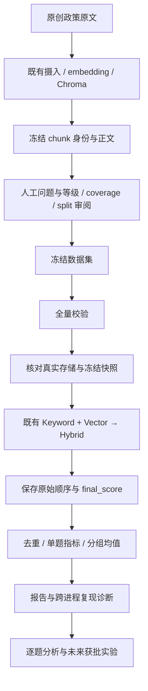

# Phase 20 — 检索评估基础：从“能返回”到“能测量”

## 1. 这一阶段到底解决了什么问题？

一个问答系统能返回十段文字，并不能说明它找齐了回答所需的证据。只看最终答案，又难以分辨问题出在检索还是生成。要比较以后采用的方案，首先需要一个身份清楚、口径固定、可以检查错误的测量起点。

这一章解释怎样把“哪些材料算正确证据”的人工判断，与现有混合检索的真实输出连接起来，再变成可复核的数字。读完后，你应能解释分数的分母、沿一条问题找到对应代码、识别错误输入与合法低分，并判断一份报告究竟证明了什么。前提是一般编程知识；Python 特有机制会在使用处解释。

## 2. Before → Problem → After

| 阶段 | 能力与缺口 |
|---|---|
| Before | 已有摄入、关键词/向量混合检索和回答生成；机械行为有测试，但没有固定题集上的检索质量参照 |
| Problem | 没有明确真值、稳定身份和统一指标，换一个方案后无法区分算法效果、数据变化与运行波动 |
| After | 具备人工审阅的版本化数据、独立评估程序、逐题与聚合报告，以及保持旧检索行为的三轮真实基线 |

新增能力位于离线评估侧，产品检索算法没有改进或替换。研究问题是“现有系统在这套题目上找到多少相关证据、排在哪里、重复执行会怎样”，不是预先证明某种优化更好。当前没有 Candidate 对比结果。下一步实验只有在变量、控制条件、比较规则及授权明确后才有意义。

## 3. 先理解必要的基础知识

### 3.1 真值、检索分数和身份

**Ground Truth（相关性真值）**是人工对“某题—某块”关系的判断。等级为 0/1/2/3，依次表示无关、弱相关、相关、高度相关。**检索分数**则由程序计算，用来排序；人工等级 2 与检索阈值 0.30 没有数值换算关系。

**Snapshot（快照）**固定语料块的身份、正文和 metadata。`chunk_id` 是块身份，`file_id` 是文件身份，`file_name` 是展示名，`chunk_index` 是块顺序而非页码。可把快照理解为固定版本的实体表，judgment 用 `chunk_id` 引用实体；但引用是否有效，还取决于它属于哪一版快照。

[摄入代码](../../backend/app/services/ingest.py) 的 `chunk_text()` 用 `uuid.uuid4()` 生成新块 ID，用 `enumerate(pieces)` 产生顺序。`enumerate` 类似 JS 中 `map((piece, index) => ...)` 的索引，但位置相同不等于身份相同。重新摄入同名文件会生成新 UUID；旧标签不能只凭文件名和顺序直接套用。正文快照也不是包含全部向量的可移植索引备份。

### 3.2 没写标签，为什么不能直接算零？

**Coverage review（覆盖审阅）**要求针对一题检查完整冻结快照，并由人工确认没有遗漏 Grade 1–3 证据。只有 screening、人工覆盖确认、`coverage_reviewed=true`、快照绑定和审阅来源均满足时，未显式列出的块才具有 **implicit Grade 0** 语义。LLM 没提出某块，不构成它无关的证据。

小规模 Pilot 有六题、38 块、30 项显式判断，另有 `6×38−30=198` 对在完整覆盖批准后具有隐式零语义。这不能改称“228 条逐项显式标注”。正式数据采用完整矩阵：40 题×38 块，共 1,520 项显式等级；两种表示都必须经过审阅。

Pilot 用于检查契约和标注流程能否工作，不会自动成为正式数据。LLM 可以提出问题、建议等级与理由；最终措辞、类别、可回答性、等级、coverage 和发布批准归 Human project owner。程序只验证必填字段、状态、格式和一致性：`decision_ref` 必须非空，但不解析引用、不认证批准记录存在，更不证明人工确实完成审阅。

### 3.3 可回答性与数据划分

**Answerable** 需要至少一个人工 grade≥2 的块；有效 **Unanswerable** 经人工确认没有这样的块，可以保留弱相关 Grade 1。不可回答题保留实际返回，但不进入主 Recall/MRR/nDCG 平均值。

**Dev** 用于研究、调参和错误分析；**Test** 留待 Candidate/config 决策后的最终评估，不得反复用于调参。依赖同一核心事实的改写应归于同一 **evidence family（证据家族）**，全家放在同一 split。换一句问法再随机划分不能消除泄漏。

当前正式题集为 32 道可回答、8 道不可回答题，20 个 families，Dev/Test 各 16A+4U。低于最初 40A+8U 的质量目标已获人工批准，不靠凑题补齐。双方共享 7 个正证据块和 2 条补充规则，核心事实划分检查无跨侧边；因此这是有披露局限的划分，不是盲测或来源完全独立的测试集。单人审阅、小样本、合成企业政策也限制了泛化。

### 3.4 三个指标各回答什么？

令某题的完整相关集合为 R，去重后的实际返回前 K 项为 P。K 固定为 1、3、5、10。

| 指标 | 计算与问题 | 不能替代的判断 |
|---|---|---|
| Recall@K | `|P∩R| / |R|`；其中 R 包含全部 grade≥2 的块。问“应找回的相关块找回了多少” | 不区分 Grade 2 和 3，也不自动证明核心答案已覆盖 |
| RR@K / MRR@K | 前 K 中第一个相关块名次为 r，则单题 RR=1/r；没有则为 0。合格题目 RR 算术平均得到 MRR | 首个相关块靠前，不代表其余必要块齐全 |
| nDCG@K | 等级先变为 gain=`2^grade−1`，即 0/1/3/7；按位置乘 `1/log2(rank+1)` 后求和为 DCG。完整真值按等级理想降序排列，以同样方法算 IDCG；两者相除 | graded 排名仍依赖人工真值，不能证明最终回答正确 |

IDCG 用完整真值，而不是只对找回的块理想排序；否则漏检可能反而得到虚高分数。Grade 1 在 nDCG 有 gain，但不能让“Answerable 且无 grade≥2”的坏数据变合法。

**Macro average（宏平均）**先算每题分数，再对合格题目等权平均。它不按 chunk 或 family 等权。各 K、split、dataset version 分开统计，另给类别分组。没有合格题目的组是 null，不是零均值。

## 4. 在整个系统中的位置



评估工具调用现有检索，产品不导入评估包。这条路径直接测量最终 Hybrid 输出，没有经过 `/api/query`、context 字符数截断、DeepSeek 或浏览器。因此检索质量与回答质量分别属于不同测量职责。API 测试通过也不能替代这里的真实模型/索引观测。

## 5. DX-RAG 最终怎么实现？

### 5.1 从输入校验到保存输出

[CLI](../../backend/evaluation/__main__.py) 先加载 JSON，验证模式和用途匹配、输出路径尚不存在、seeds 合法；每次重复启动独立 Python 进程。子进程重新读数据，父进程检查数据指纹相同，避免将不同输入混成多轮。

[validator](../../backend/evaluation/dataset.py) 在任何 search 前验证全部题目：版本、映射、等级、人工状态、覆盖条件、类别、split、同 family 不跨侧、冲突 judgment 和 Answerable 真值。坏题使整个输入失败，不会静默从分母删掉。

[V1 adapter](../../backend/evaluation/v1.py) 用公开 `list_chunks()` 核对实时 chunk ID 集、正文 SHA-256 和文件映射，确认默认 Top-K=5、阈值=0.30，再构造真实 Keyword/Vector/Hybrid。它不重新摄入、不重建索引；公开接口不能给出全部向量的逐位审计。

[measure](../../backend/evaluation/runner.py) 每题只调用一次深度 10 的 search。它校验返回类型、长度、ID 和有限分数，保存原始结果，再按第一次出现去重并记录重复位置。有效 Answerable 计分；Unanswerable 保留返回及排除原因。最后按 Dev/Test 和类别聚合。

报告保存 dataset、配置、Runner/Contract 版本、源码哈希、Git 身份和 dirty 状态、Python/依赖环境、命令、各 worker PID/hash seed、stderr、每题顺序/分数/指标以及分组分母。latency/cost 明确写 `NOT_MEASURED`。报告的 `invalid=0` 表示成功通过全部数据校验，不是把坏题算成零分。

### 5.2 为什么深度 10 的前五条不等于生产请求 5？

[Hybrid](../../backend/app/services/qa.py) 先把 top_k 乘二传给两路；Vector 再向 store 请求它接收值的两倍，然后截回接收长度。

| 入口 top_k | Keyword 候选请求 | Vector 候选请求 | VectorStore 请求 |
|---:|---:|---:|---:|
| 生产默认 5 | 10 | 10 | 20 |
| 评估 10 | 20 | 20 | 40 |

这些是请求上限，不保证实际返回数。候选不同会改变合并后的得分与排序。旧算法仍为 `0.3*keyword_score + 0.7*vector_score`，按 ID 合并、缺失一路分数取 0、降序、过滤 `<0.30`、最后 Top-K。评估 @5 是深度 10 返回的前缀；@10 是更深检索诊断，不能称为 production Recall@10。

### 5.3 采集与验证分别负责什么？

[collect.py](../v2/benchmarks/t2003-v1-baseline-1.0/collect.py) 负责执行前置身份检查、回归、真实 Runner 调用以及前后 inventory/model/release/source 核对，保存 stdout/stderr、命令和退出码。它会写证据目录，真实 Chroma 客户端也可能写持久化文件，不能因接口只读就认为执行无磁盘副作用。

[verify.py](../v2/benchmarks/t2003-v1-baseline-1.0/verify.py) 只读已有证据，不 encode、不检索。它独立写出评分公式，检查报告与冻结数据、源码及 manifest 的关系。保存报告可复算、现有环境可重跑、异机可复现，是三种不同能力。

## 6. 用一条真实数据走完整流程

[原始报告](../v2/benchmarks/t2003-v1-baseline-1.0/run-01/report.json) 中的问题 `BC01-Q014` 是：“这笔钱已经刷公司卡付了，我还要报费用吗，能再打到我个人账户吗？”以下是 2026-09-14 保存的真实本地检索结果，不是教学 fixture，也不是本次 Learning Review 新查询。

1. 数据集将问题绑定到同一冻结快照、Test split 和 family，完整人工真值包含一个 Grade 3、一个 Grade 2。
2. 输入校验通过后，真实 Hybrid 请求深度 10；Runner 保留实际顺序，不按 ID 再排序。
3. 每个返回 ID 与该题完整真值匹配，前五条等级和单题指标如下。
4. 该题纳入 Test 的 16 道 Answerable 分母，再参与宏平均。

| 项目 | seed 1 / 3 | seed 2 |
|---|---|---|
| 前五条等级 | 3, 0, 2, 0, 0 | 3, 0, 0, 2, 0 |
| Recall@3 | 1 | 0.5 |
| RR@3 | 1 | 1 |
| Recall@5 | 1 | 1 |
| nDCG@5 | 0.9558305893 | 0.9324441895 |

`IDCG@5 = 7 + 3/log2(3)`。第一种排序的 `DCG@5 = 7 + 3/log2(4)`，第二种为 `7 + 3/log2(5)`。第二块相关证据更靠后，所以折扣更大；首条仍相关，所以 RR 不变；两块仍在前五，所以 Recall@5 不变。

只有这题指标变化，Test Recall@3 变化量为 `(0.5−1)/16=−0.03125`，从约 0.885417 到 0.854167。Test nDCG@5 变化约 0.00146165。小幅均值变化可以隐藏一题的明显名次变化；这里是在比较同一基线的运行波动，没有 Candidate，也没有统计显著性结论。

另外三类真实案例帮助避免只看总分：

- `BC01-Q013` 问迟拿发票能否一直等待再报销，唯一 Grade 3 三轮均排第 9：@5 三项为 0；@10 Recall=1、RR=1/9、nDCG≈0.30103。深处找到不等于前五条有证据。
- `BC01-Q025` 的 Recall@5=0.6、@10=0.8，而 RR=1；`Q032` 对应 0.5、0.75。第一个相关片段靠前不能证明多条件问题证据齐全。`Q020` 首条 Grade 2、第三条 Grade 3，RR@5=1 而 nDCG@5≈0.730929。
- 八道不可回答题三轮全有 Grade 0/1 返回，其中 Q034 每轮 3 条，其余每轮 10 条。主指标为 null，各 split 排除 4 题。没有调用生成模型，不能据此认定正确拒答或幻觉。

## 7. 核心代码怎么读？

### 7.1 代码地图

| 概念 | 文件 | 符号 | 职责 |
|---|---|---|---|
| 有效输入 | [dataset.py](../../backend/evaluation/dataset.py) | load_dataset / validate_dataset / review | 重复 JSON key、映射、审阅与全量 fail-fast |
| 单题分数 | [metrics.py](../../backend/evaluation/metrics.py) | score_query | 完整真值作分母与 IDCG |
| 测量与复现 | [runner.py](../../backend/evaluation/runner.py) | measure / aggregate / repeatability | 保留观察、宏平均、暴露变化 |
| 真实依赖接入 | [v1.py](../../backend/evaluation/v1.py) | build_search | 公开快照核对、构造旧 Hybrid |
| 进程与报告 | [__main__.py](../../backend/evaluation/__main__.py) | worker / main | 独立进程、元数据、独占创建输出 |
| 已有检索 | [qa.py](../../backend/app/services/qa.py) | KeywordRetriever / VectorRetriever / HybridRetriever | 两路候选、固定融合及最终顺序 |

### 7.2 校验是一道前置门，不是身份认证服务

`require(condition, message)` 在不满足条件时抛 `ValueError`。`measure` 一开始便调用 `validate_dataset(data)`，所以只要最后一题无效，也不会先检索前面有效题目。测试用 Mock 断言 `search.assert_not_called()`，验证的正是这一时序。

Python 的 `bool` 是 `int` 子类；`isinstance(True, int)` 为真。校验 grade 和 chunk_index 时采用 `type(value) is int`，避免 JSON true 被当成等级 1。这不同于 TS 对 boolean/number 的类型分离。

`families.setdefault(family, query['split'])` 保存该 family 第一次出现的 split，再要求后续一致。它能发现同一 ID 跨侧，不能自动识别“同一事实被人工错误地分配了不同 family ID”。结构校验与语义审阅必须共同工作。

### 7.3 去重、截断与完整真值如何协作？

以下是 `score_query` 的真实片段，前提是输入已经验证，ranked_ids 已按首次出现去重：

```python
relevant = {cid for cid, grade in grades.items() if grade >= 2}
if not relevant:
    raise ValueError("scoring requires answerable ground truth")
ideal = sorted(grades.values(), reverse=True)
```

集合推导式建立二值相关集合，排序建立理想 gain 序列，两者职责不同。随后每个 K 取 `ranked_ids[:k]`；切片少于 K 时不会补项。核心表达式是：

```python
rank = next((i for i, cid in enumerate(prefix, 1) if cid in relevant), None)
```

`enumerate(..., 1)` 让名次从 1 开始；括号内生成器按顺序找相关块，`next(..., None)` 只取第一个，无命中返回 None。它类似按条件寻找首项的位置，但已经转成一基名次。`1 / rank if rank else 0.0` 因名次不可能为 0，可安全区分命中与无命中。

DCG 的真实实现：

```python
def dcg(values):
    return sum((2 ** grade - 1) / math.log2(rank + 1)
               for rank, grade in enumerate(values, 1))
```

实际 DCG 输入 `[grades.get(cid, 0) for cid in prefix]`，理想 DCG 输入 `ideal[:k]`。这里 `.get(cid, 0)` 合法，是因为上游已验证 ID 属于快照、coverage 完整；单独复制这个默认值到未审阅数据上会掩盖遗漏标注。

[手算 fixture](../../backend/tests/fixtures/evaluation/hand-calculated.json) 将 a/b/c 设为 3/2/1，d 是覆盖确认后的隐式 0。原始 `c,b,b,a,d` 去重成为 `c,b,a,d`：@1 Recall/RR=0，nDCG=1/7；@3 Recall=1、RR=1/2，nDCG 为 `(1+3/log2(3)+7/2)/(7+3/log2(3)+1/2)`。这是合成测试，不是正式数据表现。

### 7.4 宏平均与跨进程变化怎样保留？

`aggregate` 先按 split/category 取 members，再取 `metrics is not None` 的 eligible。每题的 recall/rr/ndcg 求和除以 count，aggregate 中 rr 改名为 mrr。count=0 时整组 metrics 为 None。重复同值 judgment 会在按 ID 构造字典时合并；冲突等级此前已被拒绝，不扩大分母。

`repeatability` 比较同一题每轮的有序 ID、ID→分数映射和指标，报告 affected_positions 及 metrics_by_run；精确比较容差为 0。ID→分数映射变化也可能来自返回集合变化，不一定是同一个向量得分漂移。

CLI 用 `subprocess.run` 逐轮启动进程，在启动环境设置 `PYTHONHASHSEED`；这影响字符串 hash 和 set 遍历。Python sort 稳定，只保证保留当前输入的同分顺序，不能使来自 set 的输入跨进程一致。fixture 的记录列表稳定，不等于真实 Keyword 候选稳定。

## 8. 为什么这么设计？

| 问题与选择 | 理由、成本与依据性质 |
|---|---|
| 精确匹配快照内 chunk_id，而非按文件名猜对应 | Documented：身份明确；重新摄入要新建版本并重映射审阅 |
| 稀疏标签允许隐式 0，但必须完整覆盖确认 | Documented：节省存储记录，不免除全快照审阅劳动；正式版本恰好采用完整矩阵 |
| 保持 grade≥2，并配合 graded nDCG | Documented：Recall/MRR 测 substantive evidence；接受二值映射对重要性的损失，未证明该阈值最优 |
| 保留旧算法及实际顺序，不为稳定性加次级排序 | Documented：测量对象不能为测量而改变；成本是如实呈现波动 |
| 独立评估包与新进程重复 | Documented：调用方式和报告可追溯；成本是加载/执行开销，当前未测 latency |
| 未强制补足题数或第二标注员 | Documented：采用获批质量优先范围；接受覆盖不足与单人偏差 |

按 ID 排序、独立请求每个 K、扩大数据或增加标注员可作为教育上的对照思路，不是本阶段已经实验比较并淘汰的方案。完整设计评价由独立 Engineering Review 负责，本文不新建 ADR 或批准架构。

**Inferred：** Q014 的无关块加分变化与 Keyword set 遍历、并列候选在截断边界进出相容；某块可能从“无 keyword 加分”变为“有加分”，最终非同分结果也会换位。**Unknown：** 没有保存两路完整候选，不能唯一排除其他因素或宣称完整根因定位。

## 9. 容易搞错的地方

- **MRR=1 不等于证据齐全。** 每题第一条相关就可得到 1，后续缺块仍影响 Recall。
- **Answerable 空返回与坏真值不同。** 前者是合法零分，要留在分母；后者阻止评估。
- **nDCG 保留 Grade 1，不代表 Answerable 只需 Grade 1。** 输入资格和评分收益是两件事。
- **真实检索不等于真实企业分布。** 模型/索引是真的，政策语料仍是项目原创合成材料。
- **三轮 40 题不是 120 个独立业务问题。** 同 family 也未必独立；三轮范围不是置信区间。
- **哈希一致不等于内容正确。** 它绑定内容身份，不认证人工等级、存储向量语义或泛化。
- **检查完成不等于排名稳定。** 真实三轮有 5 题排名变化、6 题 score map 变化、1 题指标变化；保留负向观察正是测量能力的一部分。
- **只读接口不保证磁盘不写。** 前后公开逻辑一致与持久化字节不变需要分开核对。

## 10. Failure scenarios

| Symptom | Cause / 证据性质 | Owner | Current behavior |
|---|---|---|---|
| 还没搜索就报错 | 测试覆盖：重复 query ID、未知 chunk、非法等级、缺 coverage、冲突判断、跨 split family 等 | dataset validator / 人工数据审阅 | ValueError；阻止整个输入，不跳过坏题 |
| 有效题各指标为 0 | 测试覆盖：Retriever 返回空列表 | 检索分析负责人 | 合法观察，保留分母 |
| 返回未知 ID、NaN 或超过 10 条 | 测试覆盖的无效观察 | measure / 检索接入 | 明确失败，不写成合法零分 |
| 多轮顺序或指标不同 | 历史真实观察及替代依赖测试；上游 set/截断是相容机制推断 | 复现诊断 / 后续实验协议 | 保存原序和差异，不重排、不选择性丢轮 |
| 输出路径已存在 | CLI 测试覆盖，当前代码检查 | CLI | 拒绝覆盖；文件用 x 模式创建，新运行需新目录 |
| worker 失败或采集被中断 | 代码推导风险，不虚构已发生事故 | CLI / collect | 非零 worker 阻止完整报告；采集正常异常可保存 FAIL/execution 和已有日志，硬中断未必保存尾部记录 |
| 已有 report，但没有 after inventory | 部分失败推理 | 采集/验收负责人 | 数学可复算仍不能补出缺失的后置身份检查 |
| Chroma 文件 hash 改变 | 历史实际观察：sqlite3、data_level0.bin、length.bin 改变 | 运行证据负责人 | 保留差异，公开逻辑前后相同；原因未知，不擅自归因内部维护 |

没有系统级排他锁，前后核对不能证明期间绝无瞬时外部写入。采集脚本不负责自动恢复或覆盖冻结库。原始索引应保留，不能为“修好报告”重建它。

## 11. 测试到底证明了什么？

手算测试检查公式和分母；fail-fast 测试检查失败发生在 search 前；替代 store/vector 的测试暴露真实 Keyword/Hybrid 顺序风险；API Mock 测试保护请求和响应契约；真实模型/索引采集才给出这套数据上的观察。它们回答不同问题。

| 行为 | 证据范围与时点 | 证明及边界 |
|---|---|---|
| 语料能真实入库并回读 | 历史 2026-09-09 Pilot：进程内 API integration + REAL parser/embedding/Chroma | 4 文件/38 块；不是浏览器/TCP E2E，不是 Benchmark |
| 评分与产品机械行为 | 历史 2026-09-14：评估 8/8、QA 50/50、Query 10/10 | UNIT + MOCKED/SUBSTITUTED；不证明真实语义质量 |
| 正式题集上的真实检索 | 历史 2026-09-14：真实本地 BGE/Chroma，3×40 次 Hybrid | 无 mock、无 LLM；保留全部逐题/分组值；不是回答 E2E |
| 当前工具及回归仍符合断言 | 2026-09-18 独立 Gate：7+50+10=67 项测试通过 | 未重跑写文件 CLI 测试；没有重新初始化真实索引 |
| 保存证据可重新计算 | 同日 Gate：独立复算 1,152 个指标，重放 120 条/30 组及完整诊断 | REAL 离线公式 + SUBSTITUTED 保存返回；不是实时搜索 |
| 当前对象文件身份 | 同日 Gate：29 模型文件、45 索引文件与采集后哈希一致 | STATIC 文件核对；不认证向量语义、不证明运行期间始终不变 |
| 本章文档维护 | 本次：来源/数值/链接/保留审计与独立读者检查，记录见附录 | 不再次执行模型、检索、回归或 provider，不新增质量测量 |

跨轮精确比较的容差是 0；独立公式离线复算的浮点容差是 `1e-12`，两者不能混用。成功报告三轮每侧均纳入 16A、排除 4U，无查询执行失败、无重复返回；Q004 每轮 8 条，其余 Answerable 每轮 10 条。当前 Dev Recall@5=0.9125、Test=0.90625；Test nDCG@5 为 0.894758～0.896220，不跨轮平均隐藏差异。

## 12. 当前局限

**Current limitation：** 合成单组织政策、32A+8U、单人审阅、类别不均衡、共享证据和非盲测；UUID 绑定旧快照；没有可靠页级映射；正常检索分支不透传完整 metadata，人工追溯需查快照。向量逐位语义、跨进程完全确定性和异机可移植索引均未证明。

**Future improvement：** 在明确需求和授权下可考虑更丰富语料、独立标注、可移植索引身份或更细分支诊断；这些只是需评估的能力，不是已经批准的实现。RRF、BM25、Reranker、Query Rewrite 均未采用。

**Not yet measured：** latency、cost、生成忠实度、回答/引用正确性、拒答能力、所有平台/seed 的波动范围及统计置信区间。生成评估归后续单独批准的协议；未测项目没有被暗中计为通过。

## 13. 如果规模扩大怎么办？

| 当前假设 | 首先可能出现的问题 | 可观察信号与重新考虑条件 |
|---|---|---|
| 38 块可完整人工覆盖 | 稀疏存储也不能省掉全量审阅，语料扩大会增加人力 | 实际审阅耗时、争议和漏标复查负担使当前方法不可持续时，再设计并批准新覆盖协议 |
| 全部逐题及内嵌 dataset 存于 JSON | 数据/轮次增加会扩大报告、内存和查错成本 | 实际报告大小、内存和定位时间成为问题时，再讨论分片及可追溯索引；不随意删除原始观察 |
| 一个保留的本地索引可重跑 | 协作者换机器后可能没有同一 UUID 与向量库 | 首次跨机比较需求出现时，先明确模型/索引迁移和身份验证方案 |
| 只比较少量固定重复轮次 | Candidate 的小差异可能落在基线波动内 | 当决策依赖的改善与观测波动相当时，应先批准更充分的重复/比较方法，不能挑选最好一轮 |

这些是机制推导的升级条件，不是测得的性能瓶颈，不给虚构 SLA、容量阈值或最优架构。

## 14. Self-Test

先关闭本文主动回答，再回到相应代码核对；以下不附逐题面试答案。

1. 为什么同名文件重新入库后，旧 judgment 不能直接复用？
2. 人工 grade≥2 与检索阈值 0.30 分别控制什么？
3. 未列块在什么条件下才可解释为零？198 对隐式零为什么不是新增显式标签？
4. Answerable 只有 Grade 1 与有效 Answerable 空返回分别怎样处理？
5. 为什么 Recall 分母和 IDCG 必须使用完整真值？
6. 手算 c,b,b,a,d 去重后 @1/@3 的 Recall、RR、nDCG，标明这个例子是什么证据？
7. 沿代码推导生产请求 5 和评估请求 10 的候选深度，为什么前五条不保证相同？
8. 找到在任何 search 前校验整份输入的代码和对应测试断言。
9. `next(..., None)`、`enumerate(..., 1)` 和 `type(x) is int` 各避免什么问题？
10. 为什么稳定 sort 仍可能跨进程不稳定，甚至最终非同分结果也换位？
11. Q014 若第二块相关证据从第 4 移到第 6，预测 @3/@5 的 Recall、RR、nDCG，以及 Test Recall@5 的变化量。
12. 为什么八道不可回答题均有返回，不能推出八次幻觉或八次正确拒答？
13. 若 report 存在但 after inventory 缺失，离线复算还能证明什么、不能证明什么？
14. 现有三轮为何不是 120 个独立样本？设计下一次比较前要固定哪些条件？
15. 如果隐藏所有 Task/Gate 编号，你能画出从人工真值到最终分组指标的链路，并给每一段指出源码吗？

只读练习：打开原始报告，定位 Q013/Q014 的 `raw_results`、`matched_judgments`、`metrics` 与 Test aggregate，按公式手算变化。不要运行采集脚本来“查看结果”，也不要改 Test 标签或算法来验证猜测。

## 15. 一页复习

| 记忆点 | 重建 mental model |
|---|---|
| 目的 | 先建立可解释的旧系统测量起点，再讨论优化 |
| 输入 | 固定快照 + 人工真值 + split/coverage/版本与批准来源 |
| 身份 | chunk_id 仅在绑定快照内匹配；重新摄入要新版本 |
| 流程 | 全量校验 → 实时快照核对 → 旧 Hybrid 深度 10 → 保留原序 → 首次去重 → 单题指标 → 分组宏平均 → 重复性报告 |
| 三种分数 | Recall 看覆盖，MRR 看首个相关，nDCG 看分级证据的位置 |
| 两种失败 | 坏数据停止；合法检索空结果计零并保留分母 |
| 两类真值表示 | 稀疏标签需人工覆盖确认；完整矩阵仍需审阅 |
| 三种稳定性 | 内容身份、排名、指标分别判断；一种稳定不推出另一种 |
| 证据底线 | Mock/替代重放不是实时检索，检索结果不是回答质量 |
| 使用条件 | 保留基线与全部轮次，披露深度和波动，Test 不反复调参 |

## Appendix A — Engineering References 与当前工作流状态

本章是 canonical Phase Technical Learning，按 [Workflow V2](templates/phase-learning-pass-workflow.md) 和 [模板 Part B](templates/phase-learning-template.md) 于 2026-09-18 整合；不是在 Task 日志末尾追加总结。

- **Tasks：** T2001/T2002/T2003 均 DONE，未改变既有 Task 状态或 AC。
- **Gate：** [独立 Phase 20 Gate](../verification/PHASE-20-GATE-REVIEW.md) 已建立 **PHASE_20_PASS — READY_FOR_PHASE_21**。11 AC PASS；无 BLOCKER/MAJOR/MINOR，4 INFO。本文引用结论，不重新签发 Gate。
- **Learning Review：** 概念教材已重组；本版本 fresh-reader 检查与最终验证记录见附录 C。
- **Engineering Review：** 后续独立活动已于 2026-09-18 形成[工程复盘](engineering-review/phase-20-engineering-review.md)，其读者/文档验证见附录 D；本章正文与原学习交付记录不重写。**Interview synthesis：** 未执行。
- **Phase 21：** 未启动，仍需获批协议、Task 和明确执行授权。Gate PASS 不批准任何 Candidate。

| 工程概念 | Task / SPEC / AC | 核对来源与边界 |
|---|---|---|
| 数据契约、人工权威与 Pilot | T2001；EVAL-01/02；AC-2001-1～3 | [Contract 0.3](../v2/evaluation/retrieval-evaluation-dataset-contract.md)、[Reviewed 0.2](../v2/evaluation/pilot-snapshot-01-annotation-packet-draft.md)、[Coverage](../v2/evaluation/pilot-snapshot-01/coverage-review-packet.md)；文档与历史真实入库分开 |
| Runner、公式和输入验证 | T2002；EVAL-02/SAFE-01；AC-2002-1～4 | [执行说明](../v2/evaluation/t2002-runner.md)、[测试](../../backend/tests/test_evaluation.py)；synthetic/MOCKED/SUBSTITUTED 不升级为 Benchmark |
| 正式数据与真实基线 | T2003；EVAL-03/EXP-01/SAFE-01；AC-2003-1～4 | [正式数据](../v2/evaluation/novatech-retrieval-benchmark-1.0.0/README.md)、[基线](../v2/benchmarks/t2003-v1-baseline-1.0/README.md)、[execution](../v2/benchmarks/t2003-v1-baseline-1.0/run-01/execution.json)；三轮真实本地检索 |
| 独立验收与证据边界 | Phase 20 Gate | [完整报告](../verification/PHASE-20-GATE-REVIEW.md)；2026-09-18 的 67 tests/离线复算与历史 68 tests/live 采集分开记账 |

基线身份：V1 `da8be59a60d7f35a2e3c1ab835624946c53d2a55`；测量 checkout `1692aa5877af120680d0fd386b3aa9f82b0069ea`；Runner 0.1.0，Contract 0.3，dataset novatech-retrieval-benchmark-1.0.0；corpus novatech-pilot-0.1，snapshot t2001-novatech-pilot-01。Windows/Python 3.14.6，ChromaDB 1.5.9、Sentence Transformers 6.0.1、Transformers 5.16.1、Torch 2.14.0；本地 BGE revision `7999e1d3359715c523056ef9478215996d62a620`。这些是身份记录，不是重新运行声明。

## Appendix B — Loss audit 与历史保留

[整合前 Task Learning 原稿](phase-20-task-learning-history-2026-09-18.md)已按原字节复制，SHA-256 为 `a9ea76930fc45a5816e583db35622abe74342a1f7d06230cdf6c561b429720be`；相对链接位置不变。该文件是历史资料，不是第二份当前教材。其 TODO/PENDING/未授权/Gate 未执行文字保留各次时点，当前状态以附录 A 和权威入口为准。

| 原素材 / 事实 | 本章承接位置 | 保留方式 |
|---|---|---|
| 身份、coverage、人工权威、Dev/Test、binary/graded | §3、§7、§8 | 去重后概念组织；原批准与标签不改 |
| Pilot 六题、30 显式、198 隐式；标签修改 14/接受 16 | §3 及本附录 | Pilot 不是正式 40 题；原稿含全部来源与 reader 修订 |
| CQ-005 五块 binary relevant、CQ-006 多子问语义 | 本附录及历史原稿 | CQ-005 一块 Grade 3、四块 Grade 2；含干扰数字但明确适用范围排除仍可 Grade 2，不是待修标签；完整回答必要子问可 Grade 3 |
| 手算、validator/metrics/runner/CLI、Python/TS 桥梁 | §5–7 | 合并重复代码解释，保留完整代码链接 |
| Windows 路径键修正与首次测试失败 | 本附录及历史原稿 | 历史 CLI 源码 hash key 因路径分隔符断言失败，改用 as_posix 后通过；本次未再修代码 |
| 替代同分测试与真实波动 | §7、§9–11 | 历史替代 seeds 1/2/3 顺序分别 d g e a b h c f / h b g e c d f a / g e b c f h d a；真实三轮另行记账 |
| Q013/Q014/Q020/Q025/Q032、8U、未测量项 | §6、§11–12 | 保留负向结果与逐题到聚合推导 |
| 公开逻辑/磁盘字节/向量区别、并发与失败 | §5、§10–12 | 不补造根因或移植保证 |
| 历史 reader findings、后续修订、日期及检查次数 | 历史原稿 | 原结论不覆盖新教材 fresh-reader；全部原文保留 |

独立公式脚本与报告、冻结数据包及其 manifest 不作状态同步目标。正式数据中 `benchmark_authorized=false`、原基线 README 中“Gate 尚未执行”等字段是当时状态；后续授权和本次 Gate 由 SPEC/当前索引/独立报告承接，不回写冻结证据。旧 T2001 人工 Gate 不是本次 Phase Gate。原稿没有因可读性删掉失败记录、证据边界或历史审阅意见。

## Appendix C — 本次文档验证与读者检查

本次活动为报告保存、状态同步和 Learning Review；不重复宣称同日先前 Gate 的测试为新执行。未修改产品、测试、Runner、冻结数据、原始 Benchmark 或 SPEC 行为，未启动下一阶段、未提交 Git。

### 独立 fresh-reader test — 2026-09-18

**PASS；无需要修订的明确 finding。** 执行者为本次通过 doc-coauthoring 技能 Stage 3 启动的独立 reader 子代理 `phase20_fresh_reader`，未继承会话或写作上下文。先仅阅读本章回答十个理解问题，再只读核对相关源码、Q014 原始报告和独立 Gate 文档；未修改文件，未运行测试、模型、检索或采集脚本。这是本版本的新读者检查，不继承旧 Task 素材的 reader PASS。

| 读者问题 | 独立读者正确恢复的要点 |
|---|---|
| 目标与边界 | 连接冻结数据、人工真值、Hybrid 返回和指标；止于 Hybrid，不证明生成质量 |
| 身份与重摄入 | judgment 绑定快照内 UUID；重摄入需新版本、重映射审阅 |
| 隐式零与校验 | 完整人工 coverage 后才可作零；validator 不认证人工行为或 decision_ref 真实性 |
| 指标与分母 | Recall/IDCG 用完整真值；MRR 对合格题平均；Unanswerable 排除，空有效组 null |
| 请求深度 | 生产两路 10/store 20，评估两路 20/store 40；前缀不保证相同 |
| 真实案例到聚合 | Q014 的 rank 3→4 使 Test Recall@3 下降 0.03125、nDCG@5 下降约 0.00146165 |
| 空结果与坏输入 | 前者保留分母计零，后者首次 search 前停止；无效返回也不能计零 |
| 证据边界 | 历史 REAL 检索、fixture/MOCKED/SUBSTITUTED、Gate 离线核查和本文维护分别记账 |
| 代码定位 | 能定位 dataset/metrics/runner/v1/CLI/qa/ingest 的具体职责 |
| 缺口与授权 | 小样本与非盲测限制明确；Phase 21 仍需独立协议、Task、执行授权 |

读者按 Workflow V2 A.5 和模板 Part B 确认：隐藏内部编号后正文仍可理解；概念先于符号；Python/TS 桥梁足够；真实案例数值一致；15 道自测支持计算、预测和代码定位；无重大歧义、矛盾或发现的代码/数值错误。它没有用 Gate PASS 代替教学验收，也没有要求本章承担完整 Engineering Review。读者结论不替代下面的事实、链接及范围检查。

### 文档与范围验证 — 2026-09-18

- 在本次写入前，对 243 个 tracked/untracked 非忽略现存文件建立 SHA-256 清单；写入后逐项比较，仅 8 个授权文档改变，新增 2 个文档，无删除。现存文件总数为 245。这里计数去重，不沿用前次 Gate 会话某个枚举列表可能重复计入路径的总数。
- 改变的文件：CLAUDE.md、根 README、学习 README、本章、V2 README、V2 TASKS、benchmarks README、evaluation README。新增为独立 Gate 报告和逐字节历史原稿。SPEC 虽在 Git status 中已有修改，本轮哈希未变；产品、测试、Runner、正式数据、模型/索引操作及原始 Benchmark 均未变更。
- PowerShell 下执行 `python -B -` 内存文档探针，检查上述 10 个文件的 242 个本地文件链接（不含外部 URL 与纯锚点），缺失 0；代码围栏成对；历史副本哈希与写入前原稿一致；退出 0。没有新增脚本文件。
- 同一内存探针读取保存的三轮 report.json，逐轮核对 Q013 的 RR、Q014 的 nDCG、Q020 的 nDCG、Q025/Q032 的 Recall、Q034/Q004 的返回条数，均通过；退出 0。这是保存数据的文档事实检查，不调用 Runner、encode 或检索。
- `git -c core.safecrlf=false diff --check` 与 `git diff --cached --check` 均退出 0。`git diff --cached --stat` 无输出。检索指向本章旧标题的入站锚点链接未发现匹配（rg 退出 1 表示无匹配，不是验证失败）。
- 自审完成 loss audit、learner audit 与全部相关差异检查；主线合并重复说明，原素材、历史失败/批准/reader findings 与修订原文全部保留。Gate 报告单独保存；未改冻结定义、Task AC、未来 Task、ER 或 Interview。

**交付状态：Phase Learning Review consolidation 与本版本独立 reader-test 均完成。** 后续 Engineering Review 和 Interview synthesis 未执行，Phase 21 未启动，未 commit/push。此次文档检查不重跑或升级任何历史运行证据。
